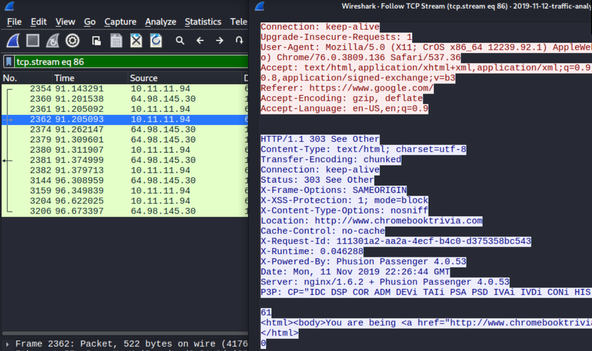
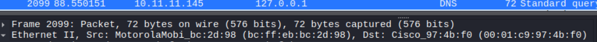
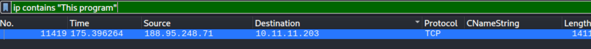
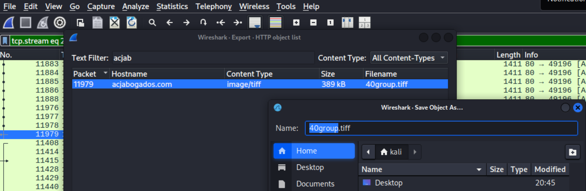
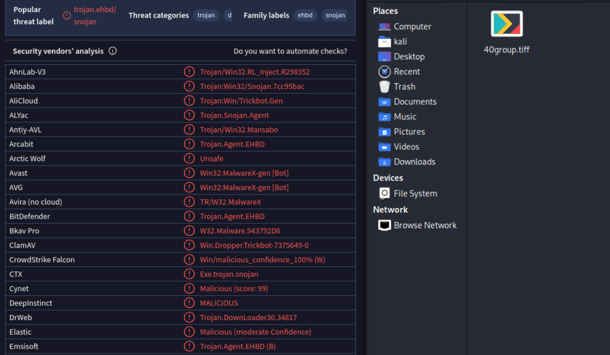

# Wireshark Intro - Okay-Boomer Traffic Analysis

Introductory network-forensics exercise: reconstructing host activity from a packet capture, fingerprinting devices, and carving and confirming a malicious download. Worked entirely in an isolated Kali environment.

Capture and scenario from Brad Duncan's [malware-traffic-analysis.net](https://www.malware-traffic-analysis.net/2019/11/12/index.html) (2019-11-12, "Okay-Boomer"), following the [Simply Cyber](https://www.youtube.com/watch?v=M8yoYmiL7rA) walkthrough.

## Scenario

> LAN segment: 10.11.11.0/24
> Domain: okay-boomer.info
> Domain controller: 10.11.11.11 (Okay-Boomer-DC)

An Active Directory environment. The goal is to identify hosts and users from their traffic, then find the machine that downloaded a Windows executable over HTTP and confirm what it was.

## Approach

Rather than hand-writing display filters, I worked from Wireshark's Statistics menu: Endpoints to enumerate hosts, and Protocol Hierarchy to see the protocol mix, applying filters straight from those views. Individual conversations were reassembled with Follow > TCP Stream. Two things drive an investigation like this: identifying the endpoints, and reading the traffic between them.

## Host and OS fingerprinting

A host's operating system and browser often leak in the HTTP User-Agent. Filtering host 10.11.11.94 to its HTTP traffic and following the stream:

```
User-Agent: Mozilla/5.0 (X11; CrOS x86_64 12239.92.1) AppleWebKit/537.36 (KHTML, like Gecko) Chrome/76.0.3809.136 Safari/537.36
```

`CrOS` identifies the device as a Chromebook running Chrome OS.



## Vendor identification from the MAC address

The first 24 bits of a MAC address (the OUI) map to the hardware vendor. This works on any packet, because the MAC lives at layer 2 and is present regardless of protocol. Host 10.11.11.145:

```
Src: MotorolaMobi_bc:2d:98 (bc:ff:eb:bc:2d:98)
```

OUI `bc:ff:eb` resolves to Motorola Mobility.



## Finding the malicious download

Windows executables (PE files) carry a fixed DOS stub string, "This program cannot be run in DOS mode," along with the `MZ` magic bytes at the start of the file. Searching packet bytes for that string surfaces any executable moving over the wire, even with no prior idea of where it came from:

```
ip contains "This program"
```

The hit shows host 10.11.11.203 pulling a PE from 188.95.248.71.



Following that stream, the request is dressed up as an image download, and the requesting host's User-Agent marks it as Windows, a different machine from the Chrome OS host earlier:

```
GET /40group.tiff HTTP/1.1
Accept: */*
Accept-Encoding: gzip, deflate
User-Agent: Mozilla/4.0 (compatible; MSIE 7.0; Windows NT 6.1; WOW64; Trident/7.0; SLCC2; .NET CLR 2.0.50727; .NET CLR 3.5.30729; .NET CLR 3.0.30729; Media Center PC 6.0; .NET4.0C; .NET4.0E)
Host: acjabogados.com
Connection: Keep-Alive
```

## Carving the file

File > Export Objects > HTTP lists every object transferred over HTTP and lets you save them out of the capture. Filtering the object list to `acjab`, one object stands out: served from acjabogados.com as `image/tiff`, 389 kB, named `40group.tiff`. The content type is a lie. The byte search already showed the file is a PE executable, not an image.



## Confirmation

Submitting the carved file to VirusTotal returns broad detection across vendors, with a threat label pointing at the Trickbot banking-trojan family.



## Indicators of compromise

```
Victim host (downloaded PE):  10.11.11.203
Malicious server:             188.95.248.71
Domain:                       acjabogados.com
File:                         40group.tiff  (served as image/tiff, actually a Windows PE)
Family:                       Trickbot
```

## Takeaway

This is the SOC/DFIR triage loop in miniature: enumerate the hosts, isolate suspicious protocols, follow the streams, carve the artifact, and validate it against an external source. Every technique here (User-Agent and MAC fingerprinting, byte-string hunting for PE headers, HTTP object export, and VirusTotal confirmation) carries directly into the graded defensive stories, and into real incident response, where the same steps identify the infected host, extract IOCs, and feed blocking and threat hunting.