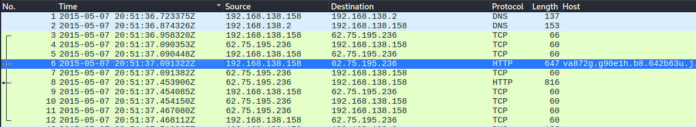
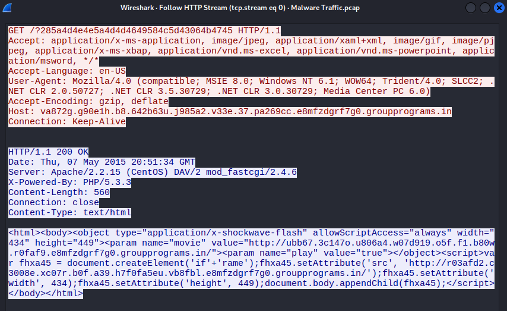
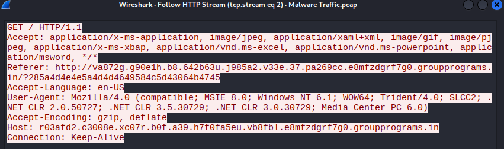
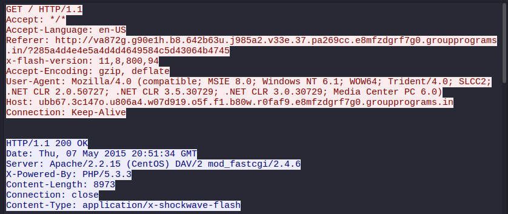
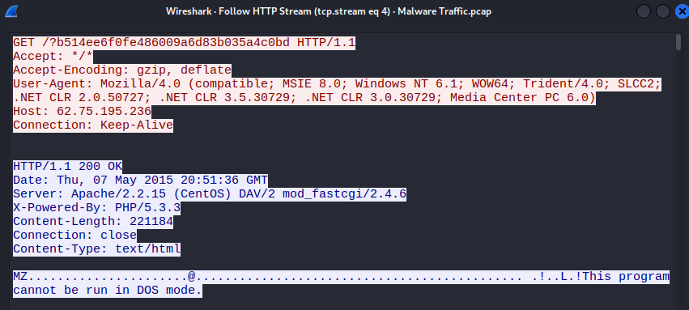
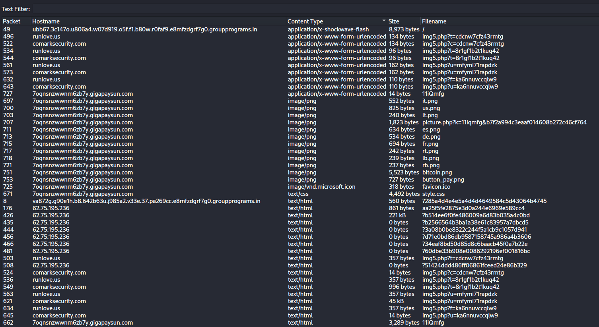
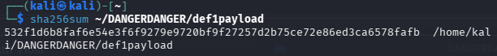
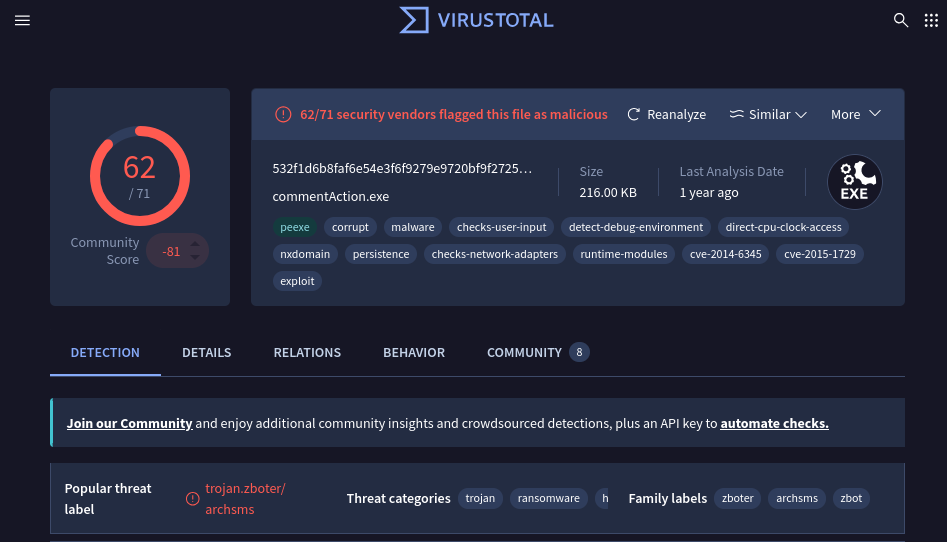
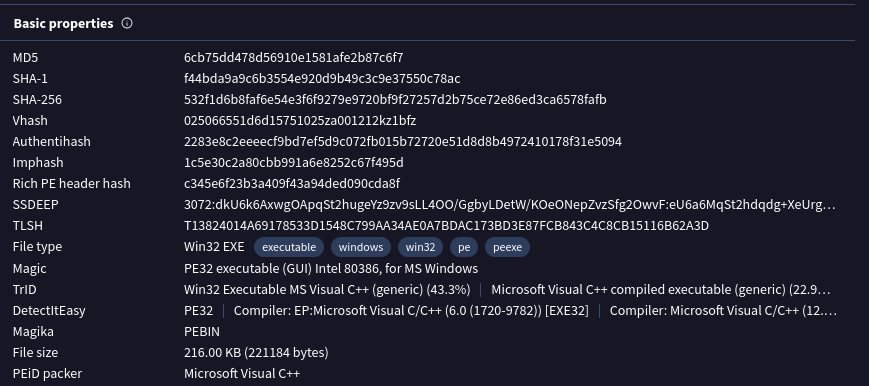

# Malware Traffic

This exercise provides a packet capture of a Windows host infected with ransomware after visiting sites advertising free movie downloads.

Analysis was done in an isolated Kali Linux VM on KVM, with the VM's network link disabled before the archive was extracted. The payload was carved and hashed inside the VM, and only the hash was looked up on VirusTotal from the host.

## Tools and Filters

Extract the provided archive inside the isolated VM:
```bash
7z x malware-traffic.zip
```

Wireshark display filters used during analysis:
```
http.request                    # every HTTP request, with a custom Host column
dns.flags.response == 0         # names the host looked up, in order
frame contains "MZ" && http     # Windows executables inside HTTP traffic
```

Hash the carved payload before any lookup:
```bash
sha256sum def1payload
```

## Starting Point

The capture opens on the infection itself rather than any earlier browsing. The first thing the host at `192.168.138.158` does is resolve a long, random-looking subdomain under `groupprograms.in`, then send an HTTP request to it at 2015-05-07 20:51:37 UTC. The server behind that name is `62.75.195.236`.


*The first DNS lookup and HTTP request go straight to the landing host.*

The request headers identify the host as Windows 7 (`Windows NT 6.1`, WOW64) running Internet Explorer 8. Link-layer addresses in this capture are zeroed, so no MAC address was recoverable.

## The Landing Page

Following the HTTP stream for that first request shows a 560 byte HTML page with no visible content. It does two things:

1. An `<object>` tag loads a Flash file from a second random subdomain, `ubb67...groupprograms.in`, with `allowScriptAccess` set to `always`.
2. A script builds an iframe pointing to a third random subdomain, `r03afd2...groupprograms.in`. The element name is written as `'if'+'rame'`, a simple way to avoid filters matching the literal string.


*The landing page exists only to pull in the next two stages.*

The capture doesn't show how the host reached this page. The request carries no Referer, which is common with exploit kits that strip it to hide the referring site.

## The Handoff

Both follow-up requests carry the landing page as their Referer, which ties all three hostnames into one chain.

The iframe request to `r03afd2...groupprograms.in` came from the landing page script.


*The hidden iframe loads from the third subdomain.*

The Flash request to `ubb67...groupprograms.in` includes an `x-flash-version: 11,8,800,94` header, reporting the exact Flash build to the server. The server answered with an 8,973 byte `application/x-shockwave-flash` file.


*The exploit is served after the browser reports its Flash version.*

## The Payload

Seconds later, the host requests a file directly from `62.75.195.236` with no hostname and no Referer. The response is labeled `text/html`, but the body begins with `MZ` and "This program cannot be run in DOS mode," the header of a Windows executable. The response is 221,184 bytes.


*A Windows executable served as a web page.*

The mismatch between content type and content is one of the clearest signals in the capture. A browser rendering HTML never needs a PE file.

Export Objects shows the full session, including everything after the payload arrived.


*Flash from the kit, the payload from the bare IP, then check-ins and the ransom page.*

## Identifying the File

The 221 kB object was exported as `def1payload`, hashed, and looked up on VirusTotal.



VirusTotal returned 62 of 71 vendor detections under the filename `commentAction.exe`. The popular threat label is `trojan.zboter/archsms`, the threat categories include trojan and ransomware, and the file is tagged with CVE-2014-6345 and CVE-2015-1729.


*commentAction.exe, flagged by 62 of 71 vendors.*

The file size on VirusTotal, 221,184 bytes, matches the payload response's `Content-Length` exactly, confirming the lookup is the same file carved from the capture.


*Hashes and file size for the IOC record.*

## After Infection

The remaining traffic is the malware running, not part of delivery:

- A request to `ip-addr.es`, a public IP lookup service.
- Repeated `POST` requests alternating between `runlove.us` and `comarksecurity.com` to `img5.php` with short tokens, consistent with command and control check-ins.
- A lookup of `kritischerkonsum.uni-koeln.de` in the same window as the check-ins.
- Requests to `7oqnsnzwwnm6zb7y.gigapaysun.com` for `bitcoin.png`, `button_pay.png`, `style.css`, and two-letter country flag images, consistent with a multi-language ransom payment page.

These are useful indicators, but they aren't responsible for the infection. They only appear after the executable was delivered.

## Answers

**Three hostnames responsible for the infection**
- `va872g.g90e1h.b8.642b63u.j985a2.v33e.37.pa269cc.e8mfzdgrf7g0.groupprograms.in` (landing page)
- `ubb67.3c147o.u806a4.w07d919.o5f.f1.b80w.r0faf9.e8mfzdgrf7g0.groupprograms.in` (Flash exploit)
- `r03afd2.c3008e.xc07r.b0f.a39.h7f0fa5eu.vb8fbl.e8mfzdgrf7g0.groupprograms.in` (hidden iframe)

**File used to execute the malware:** `commentAction.exe`

## Indicators of Compromise

| Type | Value | Role |
|---|---|---|
| Domain | `*.e8mfzdgrf7g0.groupprograms.in` | Exploit kit landing, iframe, and Flash hosts |
| IP | `62.75.195.236` | Exploit kit server and payload delivery |
| Filename | `commentAction.exe` | Executed payload |
| SHA256 | `532f1d6b8faf6e54e3f6f9279e9720bf9f27257d2b75ce72e86ed3ca6578fafb` | Executed payload |
| MD5 | `6cb75dd478d56910e1581afe2b87c6f7` | Executed payload |
| Domain | `ip-addr.es` | Post-infection IP lookup |
| Domain | `runlove.us` | Post-infection check-ins |
| Domain | `comarksecurity.com` | Post-infection check-ins |
| Domain | `kritischerkonsum.uni-koeln.de` | Post-infection lookup |
| Domain | `7oqnsnzwwnm6zb7y.gigapaysun.com` | Ransom payment page |

## Takeaways

Delivery took a few seconds and needed nothing from the user beyond loading a page. It depended on an outdated browser and Flash plugin. Signals that would catch it on the wire:

- **Random, deeply nested subdomains** under one parent domain, resolved back to back.
- **An executable served as `text/html`**, fetched from a bare IP with no Referer.
- **Plugin version headers** followed immediately by a binary download.

Removing Flash and retiring Internet Explorer closes this exploit path. DNS and web filtering would block the newly seen domains, an IDS rule for PE headers in HTML-labeled responses would flag the payload, and endpoint protection would stop `commentAction.exe` from running. The domains, IP, and hash above can go straight into blocklists and detections.