# Malware Analysis

This exercise provides a packet capture from a Windows host infected by three separate malware families. The goal was to identify the victim, reconstruct the infection chain, and pull out whatever indicators and files the capture contains.

Analysis was done in an isolated Kali Linux VM on KVM, reverted to a clean snapshot with the network link disabled before the archive was extracted. Files were carved and hashed inside the VM, and only the hashes were looked up on VirusTotal from the host.

## Tools and Filters

Extract the provided archive inside the isolated VM:
```bash
7z x malware-analysis.zip
```

Wireshark display filters used during analysis:
```
nbns                                                        # hostname and MAC from NetBIOS registration
kerberos.CNameString and not (kerberos.CNameString contains "$")   # Windows user, machine accounts excluded
http.request and !(http.host contains "microsoft")          # HTTP requests without Windows Store noise
```

Decode the Word document embedded in the landing page:
```bash
grep -oE '[A-Za-z0-9+/=]{200,}' uninvitingSecond.php | head -n 1 | base64 -d > doc.bin
```

Identify and hash the carved files:
```bash
file *
sha256sum *
```

## Finding the Victim

Statistics > Endpoints shows `10.2.8.101` as the busiest address in the capture with over 20,000 packets.

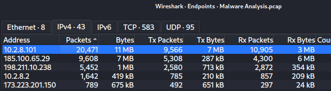

*10.2.8.101 accounts for most of the traffic.*

There's no DHCP in the capture, so the hostname came from NBNS. The host registers itself as `DESKTOP-MGVG60Z`, and the Ethernet header gives its MAC address as `00:12:79:41:c2:aa`, a Hewlett-Packard OUI.

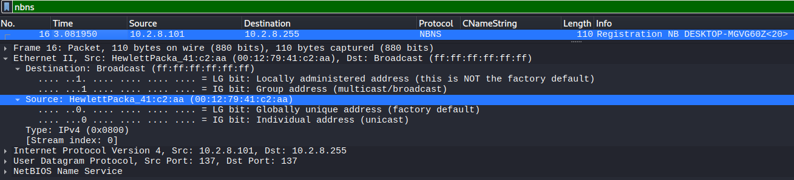

*Hostname and MAC address from a single NBNS packet.*

Kerberos traffic to the domain controller at `10.2.8.2` shows the logged-in user. Filtering out names ending in `$` removes the computer's own machine account and leaves `bill.cook`.

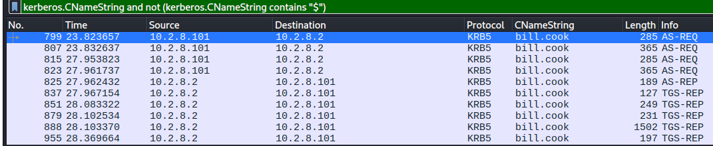

*bill.cook authenticating to the domain controller.*

## Infection Timeline

HTTP traffic from the host is buried under dozens of requests to `store-images.s-microsoft.com`, which is Windows pulling Start menu and Store images in the background. With that filtered out, the whole chain fits in about a minute.

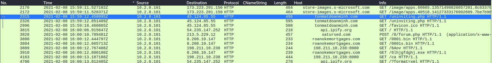

*Landing page, check-in, payload downloads, and beaconing, all on 2021-02-08.*

| Time (UTC) | Request |
|---|---|
| 15:59:12 | GET `tonmatdoanminh[.]com/uninviting.php` (twice) |
| 16:00:06 | GET `api.ipify.org` |
| 16:00:10 | POST `satursed[.]com/8/forum.php` |
| 16:00:12 | GET `roanokemortgages[.]com/0801.bin` and `/0801s.bin` |
| 16:00:12 | GET `198.211.10[.]238:8080/6Aov` |
| 16:00:12 | GET `roanokemortgages[.]com/6lhjgfdghj.exe` |
| 16:01:13 | Steady GET `/ca` requests to `198.211.10[.]238:8080` begin |

Export Objects lists everything carvable from the HTTP traffic, including repeated `forum.php` requests that keep coming well after the first one.

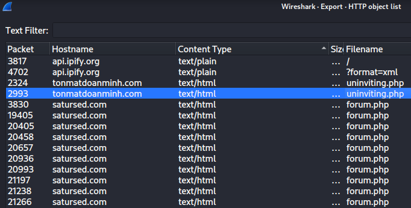

*Two responses from the landing page and a long run of forum.php check-ins.*

## The Landing Page

The host requested `/uninviting.php` twice within half a second. The first response is a 754 byte script that sets a cookie and reloads the page. VirusTotal had one detection on it, a generic Kaspersky verdict.

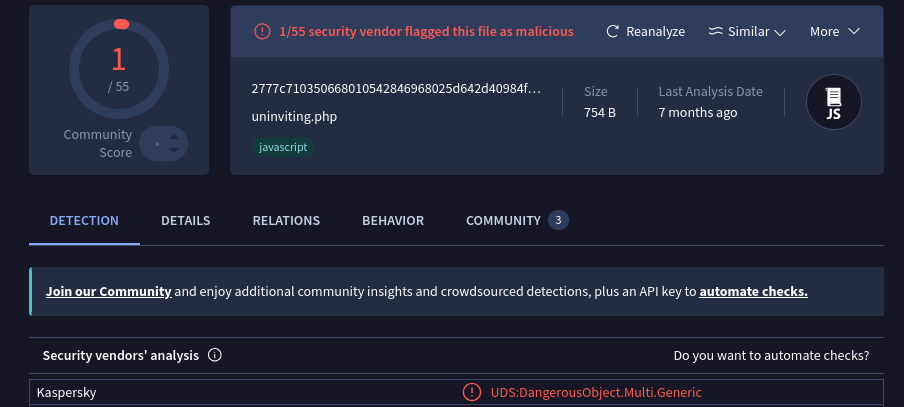

*A small script with a single generic detection.*

The second response is where the delivery happens. It carries a long base64 string, and the script converts it to a byte array, wraps it in a Blob, and saves it to disk as `0208_54741869750132.doc`. A meta refresh then points the browser to a punycode lookalike domain with the same document name in the path. The request to `/uninviting.php` has no Referer, which fits a link clicked from outside the browser such as an email.

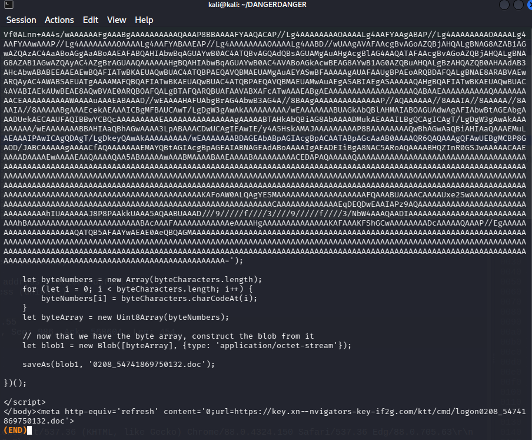

*The document is built in the browser, so it never appears as a separate download.*

Decoding the base64 string gave a legacy Word file created on the same day, one page long with three words of text.

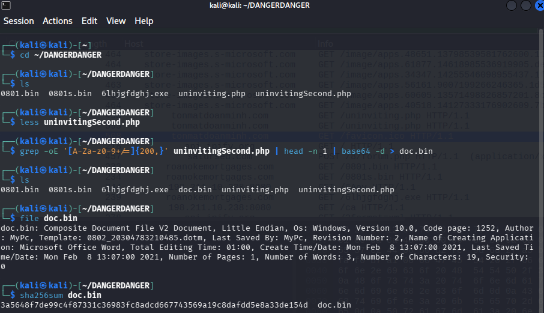

*file identifies a Composite Document File, the old .doc format.*

VirusTotal flagged it 42 of 61 with `hancitor` among the family labels. The tags include `macros` and `auto-open`, and the code insights describe a `Document_Open` macro that ends up calling `rundll32.exe`. That's the step that turns opening the document into running malware.

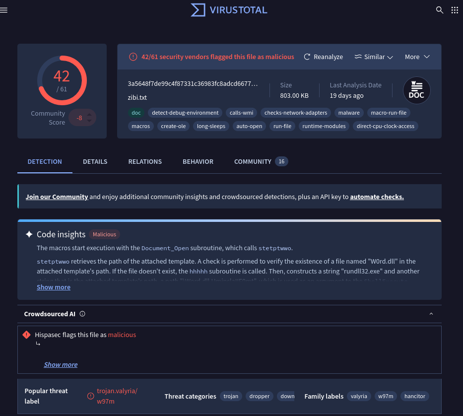

*Hancitor maldoc, 42 of 61 detections.*

## Hancitor Check-In

About a minute after the document arrived, the host asked `api.ipify.org` for its public IP, then sent a POST to `satursed[.]com/8/forum.php`. The body contains a GUID, a build string, the hostname and user (`DESKTOP-MGVG60Z @ ASCOLIMITED\bill.cook`), the domain `ascolimited.com`, the public IP it just looked up, and the Windows version. The server replied with an encoded blob.

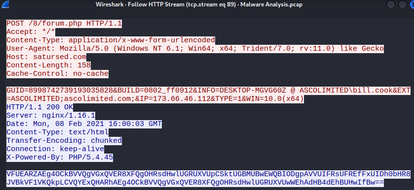

*Hancitor reporting the infected host to its C2.*

This is Hancitor's standard check-in format. The encoded response carries instructions, which is why the payload downloads start two seconds later.

## Follow-Up Payloads

Three files came from `roanokemortgages[.]com` right after the check-in. `file` shows the executable as a 32-bit Windows GUI program. The two `.bin` files have no recognizable format.

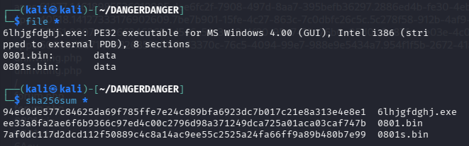

*One PE executable and two blobs of unidentified data.*

`6lhjgfdghj.exe` was flagged 60 of 70 on VirusTotal. The family labels are `zudochka`, `doina`, and `fickerstealer`, all names used for Ficker Stealer, an information stealer.

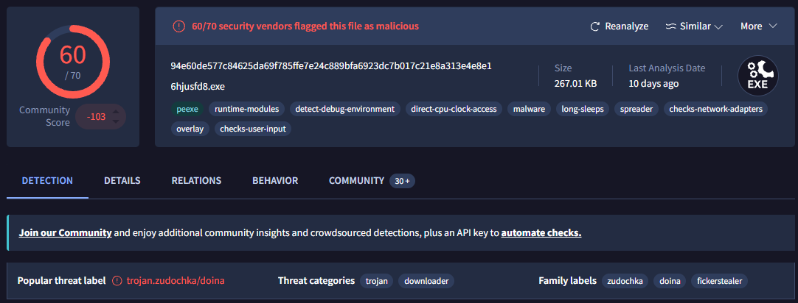

*Ficker Stealer, 60 of 70 detections.*

Neither `.bin` file had any VirusTotal detections. That is consistent with encoded shellcode, which gives antivirus nothing to match until it's decoded in memory. What identifies them is the traffic that follows.

## Cobalt Strike Beaconing

Alongside the payload downloads, the host fetched `/6Aov` from `198.211.10[.]238` on port 8080. A minute later it started sending `GET /ca` to the same address every fraction of a second, with periodic `POST /submit.php?id=3275377518` requests mixed in.

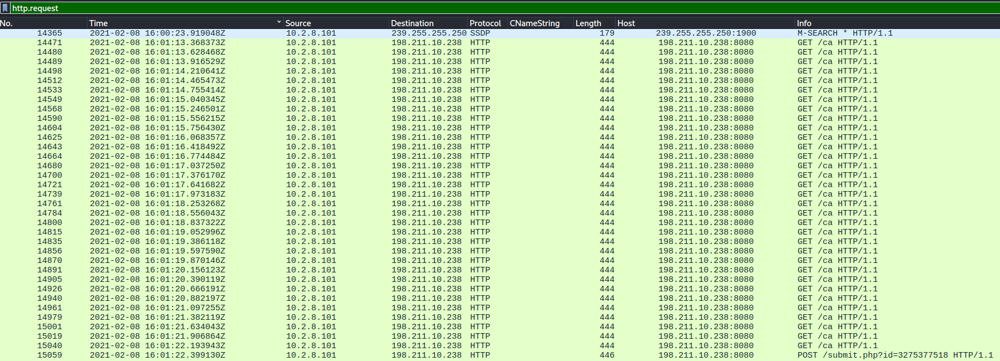

*Beacon check-ins with a task result posted back.*

A short random URI to pull the stager, repeated GETs asking for tasks, and POSTs to `submit.php` returning results is the default Cobalt Strike HTTP profile. The IP is hosted on DigitalOcean, which says nothing about whether it's legitimate. Cheap cloud servers are a common place to run C2.

## Indicators of Compromise

| Type | Value | Role |
|---|---|---|
| Domain | `tonmatdoanminh[.]com` | Landing page serving the Hancitor document |
| IP | `45.124.85[.]55` | tonmatdoanminh[.]com |
| Domain | `satursed[.]com` | Hancitor C2 (`/8/forum.php`) |
| IP | `213.5.229[.]12` | satursed[.]com |
| Domain | `roanokemortgages[.]com` | Payload hosting |
| IP | `8.208.10[.]147` | roanokemortgages[.]com |
| IP | `198.211.10[.]238:8080` | Cobalt Strike C2 |
| Filename | `0208_54741869750132.doc` | Hancitor maldoc |
| SHA256 | `3a5648f7de99c4f87331c36983fc8adcd667743569a19c8dafdd5e8a33de154d` | Hancitor maldoc |
| Filename | `6lhjgfdghj.exe` | Ficker Stealer |
| SHA256 | `94e60de577c84625da69f785ffe7e24c889bfa6923dc7b017c21e8a313e4e8e1` | Ficker Stealer |
| SHA256 | `ee33a8fa2ae6f6b9366c97ed4c00c2796d98a371249dca725a01aca03caf747b` | 0801.bin |
| SHA256 | `7af0dc117d2dcd112f50889c4c8a14ac9ee55c2525a24fa66ff9a89b480b7e99` | 0801s.bin |

## Takeaways

One click and one macro prompt were enough to go from a Word document to two more malware families and an operator with hands on the machine, all inside about a minute. Hancitor's job is only to get in and report back. The damage comes from what it's told to download.

Things that stand out on the wire:

- An HTML response containing a huge base64 string and a `saveAs` call with a `.doc` filename.
- A public IP lookup followed immediately by a form POST carrying the hostname and user account.
- Binaries fetched from a site with no connection to anything the user was doing.
- Hundreds of identical small GETs to a bare IP on a nonstandard port.

Blocking macros in documents from the internet stops this chain at the first step. Web and DNS filtering would cover the landing and payload domains, IDS rules for Hancitor's check-in format and default Cobalt Strike URIs would catch the C2 traffic, and EDR would flag `rundll32.exe` launching from a Word process.