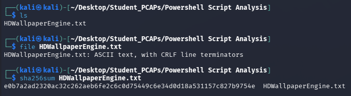
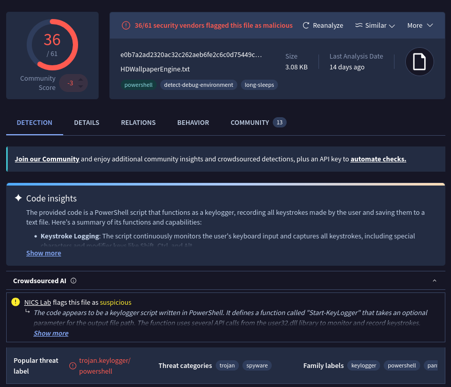
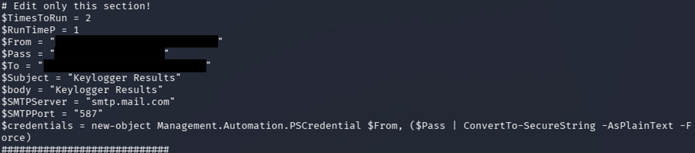
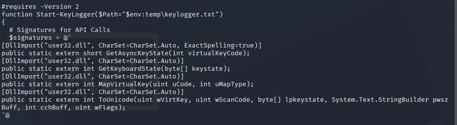
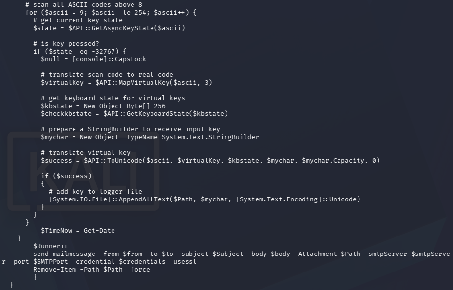

# PowerShell Script Analysis

This exercise provides a suspicious PowerShell script saved as `HDWallpaperEngine.txt`. The goal was to work out what it does through static analysis only, without running it.

Analysis was done in an isolated Kali Linux VM on KVM, reverted to a clean snapshot with the network link disabled before the archive was extracted. The script was read as plain text and never executed. Only the hash was looked up on VirusTotal from the host.

Hardcoded credentials in the script are redacted in the screenshots and this writeup.

## Tools and Commands

Confirm the file type and hash it before opening:
```bash
file HDWallpaperEngine.txt
sha256sum HDWallpaperEngine.txt
```

Read the script without executing it:
```bash
less HDWallpaperEngine.txt
```

## The File

`file` reports plain ASCII text with Windows line endings. Saving a PowerShell script as `.txt` keeps it from running on a double-click, and the name `HDWallpaperEngine` makes it look like something harmless.



*A 3 KB text file posing as a wallpaper program.*

VirusTotal flagged the hash 36 of 61 with the popular threat label `trojan.keylogger/powershell`.



*Detected as a PowerShell keylogger.*

## Configuration

The script opens with a block headed `# Edit only this section!`, which tells you it was built as a template for someone to fill in and use. It sets:

- `$TimesToRun = 2` and `$RunTimeP = 1`: two collection cycles of one minute each
- `$From` and `$To`: the same Gmail address, so the logs are mailed back to the sender
- `$Pass`: the account password in plaintext
- `$SMTPServer = "smtp.mail.com"` and `$SMTPPort = "587"`: the mail server and submission port

The password is passed through `ConvertTo-SecureString -AsPlainText -Force` to build a `PSCredential` object. That only satisfies the cmdlet's type requirement. Anyone who reads the file still has the password.



*The only section meant to be edited, with the account details redacted.*

The server doesn't match the account. A Gmail address authenticating against `smtp.mail.com` would most likely fail, so this copy may never have delivered anything. The intent is still clear.

## Windows API Imports

The main function is `Start-KeyLogger`, and its default output path is `$env:temp\keylogger.txt`, the current user's Temp folder. That location is writable without admin rights and rarely checked.

The function defines four C# signatures imported from `user32.dll` and loads them with `Add-Type`:

- `GetAsyncKeyState`: whether a given key is currently down
- `GetKeyboardState`: the state of every key, including Shift and Caps Lock
- `MapVirtualKey`: converts scan codes to virtual key codes
- `ToUnicode`: turns a key and keyboard state into the actual character typed



*Everything needed to read the keyboard from user mode.*

None of these need elevated privileges. Any process running as the user can call them.

## Capture and Exfiltration

Inside each cycle the script sleeps 40 milliseconds, then checks every key code from 9 to 254 with `GetAsyncKeyState`. A return value of `-32767` means the key was pressed since the last check. For each hit it builds the keyboard state, converts the key to a character with `ToUnicode`, and appends it to the log file.

When a cycle ends, `Send-MailMessage` emails the log as an attachment over SSL using the stored credentials, and `Remove-Item` deletes the file.



*Poll, translate, append, then mail the file and delete it.*

Deleting the log after each send means there's little left on disk to find later. The `finally` block has a comment about opening the log in Notepad but the code only exits, a leftover that suggests the script was adapted from an existing keylogger sample.

There's no obfuscation, persistence, or attempt to hide a console window. It runs once for the configured cycles and stops.

## Indicators of Compromise

| Type | Value | Role |
|---|---|---|
| Filename | `HDWallpaperEngine.txt` | Keylogger script |
| SHA256 | `e0b7a2ad2320ac32c262aeb6fe2c6c0d75449c6e34d0d18a531157c827b9754e` | Keylogger script |
| File path | `%TEMP%\keylogger.txt` | Keystroke log |
| Domain | `smtp.mail.com` | SMTP server used for exfiltration |
| Port | `587/TCP` | SMTP submission |
| Email subject | `Keylogger Results` | Exfiltration email |

## Takeaways

The script is short and needs nothing beyond a normal user session. Most of what it does is visible to defenders if the right logging is in place:

- PowerShell script block logging (Event ID 4104) would capture the full script, including `Add-Type` with `GetAsyncKeyState` and the credentials.
- A workstation sending mail on port 587 directly, outside the normal mail client, stands out in firewall or proxy logs.
- A file in `%TEMP%` that keeps growing and gets deleted on a schedule is worth an EDR alert.

Restricting PowerShell with Constrained Language Mode or application control would block the `Add-Type` call that makes the API imports work. Blocking outbound SMTP from workstations cuts off the exfiltration path. The hardcoded account should be reported to the mail provider so it can be disabled.