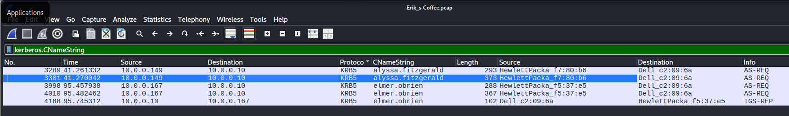
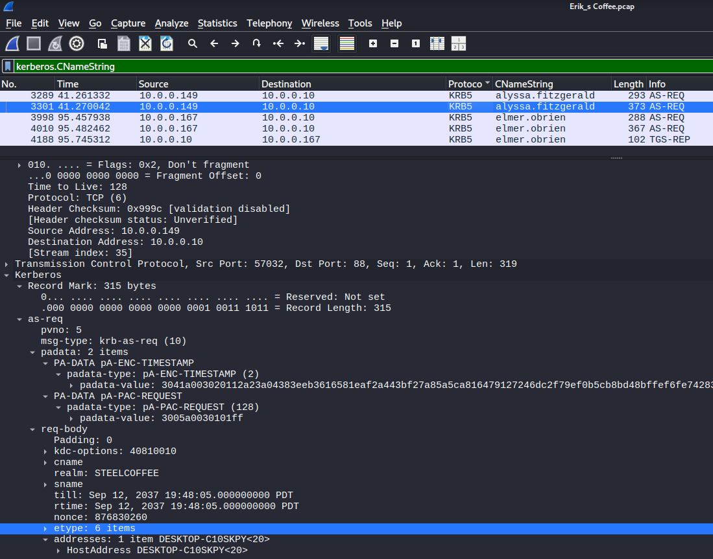
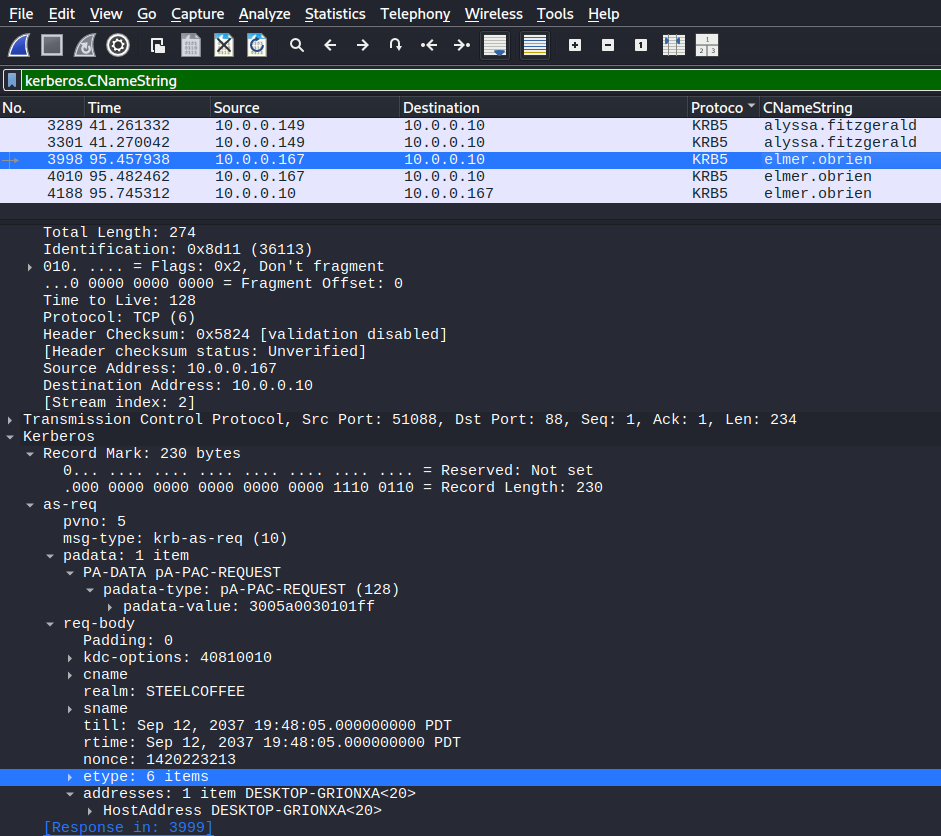
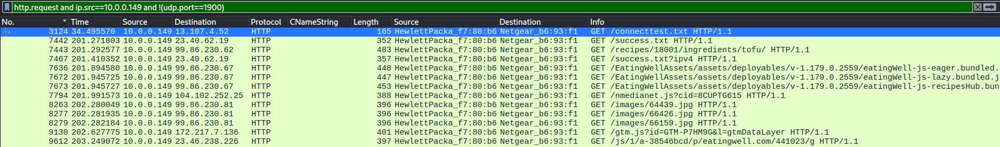
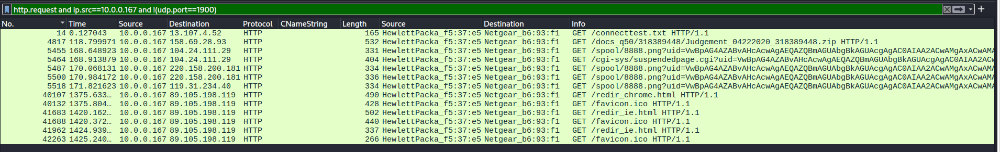
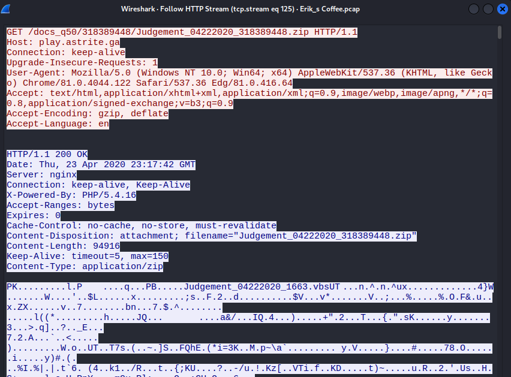
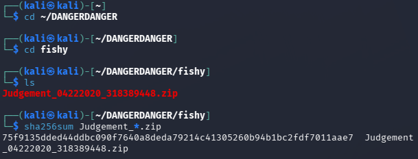
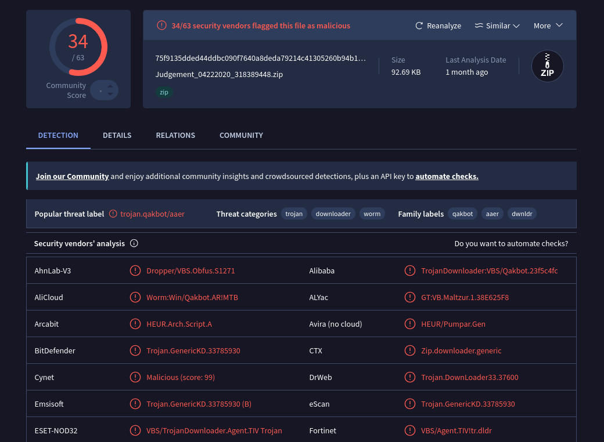

# Erik's Coffee Packet Analysis

This exercise provides a packet capture from a small business network with two Windows clients, one of which was infected. The goal was to identify both Windows hosts and their user accounts, determine which host was infected, and name the malware, working from the capture and its indicators alone.

Analysis was done in an isolated Kali Linux VM on KVM, reverted to a clean snapshot with the network link disabled before the archive was extracted. The capture was read in Wireshark. The only file carved from it, a zip, was hashed inside the VM, and only the hash was looked up on VirusTotal from the host. Nothing was extracted or executed.

## Tools and Commands

Wireshark display filters carried the whole investigation. Identify the domain accounts and their hosts:
```
kerberos.CNameString
```

Separate each client's web traffic, dropping SSDP noise:
```
http.request and ip.src==10.0.0.149 and !(udp.port==1900)
http.request and ip.src==10.0.0.167 and !(udp.port==1900)
```

The suspicious download was carved with File > Export Objects > HTTP, then hashed inside the VM:
```bash
sha256sum Judgement_*.zip
```

## Identifying the Hosts and Users

Kerberos authentication is the fastest way to map a Windows network. The AS-REQ carries the account name in `CNameString`, and the request body names the host in its address field. Filtering on `kerberos.CNameString` surfaced two domain users in the `STEELCOFFEE` realm authenticating to the domain controller at 10.0.0.10.



*Two users, two clients, both Hewlett-Packard machines, authenticating to the domain controller.*

Each user's AS-REQ names its workstation in the request body. alyssa.fitzgerald authenticates from DESKTOP-C10SKPY, and elmer.obrien from DESKTOP-GRIONXA.



*alyssa.fitzgerald on DESKTOP-C10SKPY.*



*elmer.obrien on DESKTOP-GRIONXA.*

That gives the two Windows clients:

- alyssa.fitzgerald, DESKTOP-C10SKPY, 10.0.0.149, MAC 6c:c2:17:f7:80:b6
- elmer.obrien, DESKTOP-GRIONXA, 10.0.0.167, MAC ac:16:2d:f5:37:e5

## Which Host Was Infected

With both hosts identified, comparing their outbound HTTP separates the victim from the bystander. alyssa's traffic is ordinary browsing: a recipe site, its assets, and the usual analytics and ad calls. Nothing is pulled that shouldn't be.



*10.0.0.149, ordinary recipe-site browsing. No payload, no callbacks.*

elmer's traffic is a different story. Early in the session the host fetches a zip archive, and shortly after it begins making repetitive requests to several external servers, each carrying an encoded `uid` parameter. That pattern, a download followed by beacon-style callbacks, is an infected host reaching its command-and-control infrastructure.



*10.0.0.167 pulls a zip, then beacons to spool/8888.png with an encoded uid on multiple hosts.*

elmer.obrien on DESKTOP-GRIONXA is the infected client.

## The Payload

Following the HTTP stream for the download shows the request and the server response in full. The host at play.astrite[.]ga returns HTTP 200 with `Content-Type: application/zip` and a `Content-Disposition` attachment named `Judgement_04222020_318389448.zip`. The zip body begins with the `PK` signature, and the archive stores its contained filename in cleartext: `Judgement_04222020_1663.vbs`. The delivered file is a zip wrapping a VBScript downloader, and the 200 confirms it was actually received.



*The archive delivered from play.astrite[.]ga, wrapping a VBScript downloader.*

## Confirming the Malware

The zip was carved with Export Objects and hashed inside the VM. The SHA256 matches the sample on VirusTotal, giving a clean chain from the capture to the verdict.



*Carved zip hashed for lookup.*

VirusTotal flagged the file 34 of 63 with the popular threat label `trojan.qakbot/aaer` and family labels qakbot, aaer, and dwnldr. The malware is Qakbot (also Qbot), a modular banking trojan and information stealer that also functions as a loader. VirusTotal's categories, trojan, downloader, and worm, describe its behavior; the VBScript stage seen in the capture is the downloader that pulls it in.



*Identified as Qakbot, delivered by a VBScript downloader.*

## Indicators of Compromise

| Type | Value | Role |
|---|---|---|
| Victim host | DESKTOP-GRIONXA, 10.0.0.167, MAC ac:16:2d:f5:37:e5 | Infected client (user elmer.obrien) |
| Domain | play.astrite[.]ga | Served the malicious zip |
| Filename | Judgement_04222020_318389448.zip | Delivered archive |
| Filename | Judgement_04222020_1663.vbs | VBScript downloader inside the archive |
| SHA256 | 75f9135dded44ddbc090f7640a8deda79214c41305260b94b1bc2fdf7011aae7 | Carved zip |
| C2 | 104.24.111[.]29, 220.158.200[.]181, 119.31.234[.]40 | Beacon check-ins (spool/8888.png?uid=) |
| C2 | 89.105.198[.]119 | Serves redir_chrome.html / redir_ie.html |

## Takeaways

The infection is visible at several points a defender already monitors:

- A workstation fetching a zip from a newly-seen free-TLD domain is anomalous egress. Freenom TLDs (.ga, .tk, .ml, .cf, .gq) are heavily abused for malware delivery and are reasonable to block or alert on at the DNS or proxy layer.
- The `uid=` beacons to spool/8888.png are Qakbot check-ins. Repetitive GETs to multiple external hosts carrying the same encoded parameter are a detectable beacon pattern in proxy logs or an IDS rule.
- Kerberos and NetBIOS traffic scope an incident quickly. The account and host behind an IP are in the auth traffic, which is what tells you which asset and which user to isolate first.

On the prevention side: block or restrict Windows Script Host so a `.vbs` cannot execute on double-click, enforce application control on script interpreters, and filter outbound access to free-TLD and low-reputation domains to cut the delivery channel.