# Find the Culprit

Analysis of a provided packet capture from a Windows host that was already compromised when the capture began. The exercise asks for the root cause of the infection. The capture does not contain one, and establishing that with evidence is most of the work.

All analysis was done inside an isolated Kali VM on KVM, reverted to a clean snapshot beforehand. The network link was disabled before the archive was extracted. Carved files were hashed inside the VM and only the hashes were looked up on VirusTotal from the host. Nothing was extracted to the host and nothing was executed.

## Scoping the capture

The file holds 1,961 packets spanning 2015-09-22 22:32:14 to 22:57:28 UTC, just over 25 minutes. Wireshark's capture properties dialog renders those times in the analyst machine's local zone, so the packet list time column was set to UTC and every timestamp below is UTC. The C2 server's own HTTP response headers later confirmed this independently.

Protocol Hierarchy first, before any filtering, to see what is actually in the file.

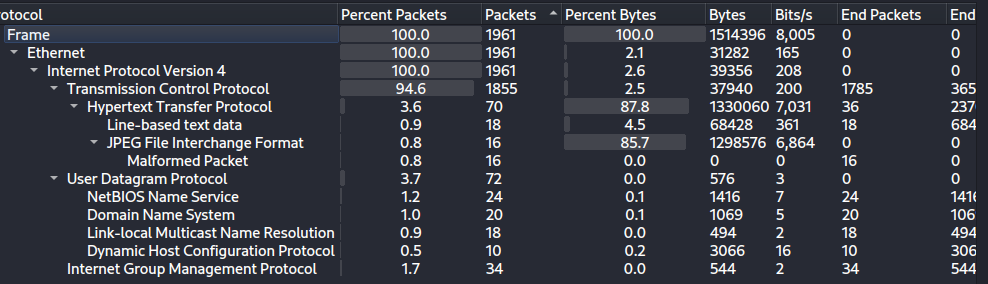

*Protocol Hierarchy across all 1,961 packets. No SMTP, no TLS, no SMB, no FTP.*

That absence matters more than the presence. There is no mail traffic, no encrypted session that could hide a download, and no file sharing. Whatever put malware on this host did not travel over any of it. The 16 malformed packets under JPEG File Interchange Format are noted here and explained later.

## Identifying the host

DHCP, NBNS and the Ethernet header between them give the full victim profile.

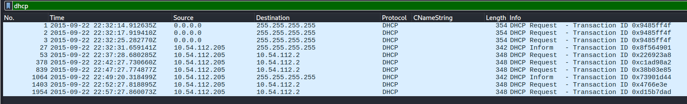

*DHCP Request at 22:32:14 and periodic renewals from 10.54.112.205.*

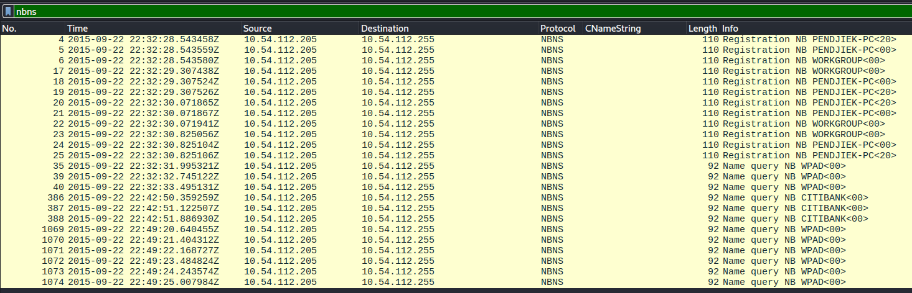

*NetBIOS name registrations for PENDJIEK-PC and workgroup WORKGROUP.*

The host registers as PENDJIEK-PC in WORKGROUP. A `kerberos.CNameString` filter returns nothing, so there is no Active Directory domain here and no domain account to attribute activity to.

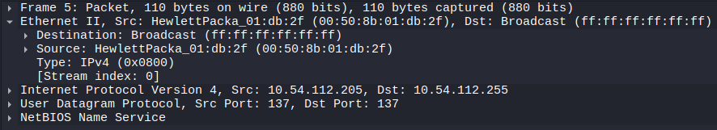

*Ethernet source address 00:50:8b:01:db:2f, OUI Hewlett-Packard.*

For the operating system, the capture contains no ordinary browsing. The only User-Agent strings belong to Windows' own connectivity check and to the malware. The malware's own requests carry a full Internet Explorer 8 string including real .NET CLR version tokens, which is consistent with requests issued through the system's own HTTP stack rather than a forged header.

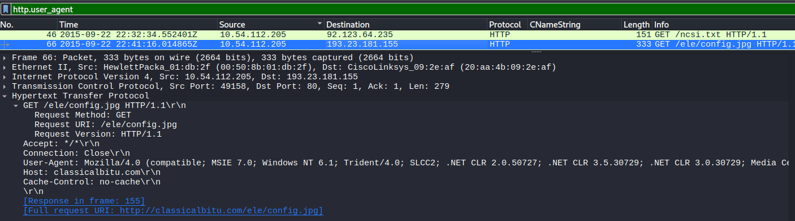

*Frame 66. Windows NT 6.1 in the User-Agent and Host: classicalbitu.com.*

Windows NT 6.1 is Windows 7. The mshome.net DNS suffix and the NetBIOS registrations corroborate Windows independently.

| Field | Value |
|---|---|
| IP | 10.54.112.205 |
| MAC | 00:50:8b:01:db:2f (Hewlett-Packard) |
| Host name | PENDJIEK-PC |
| Domain | none, workgroup WORKGROUP |
| OS | Windows 7 |

## What the host actually talked to

Filtering on HTTP requests produces a striking result for a 25 minute capture.

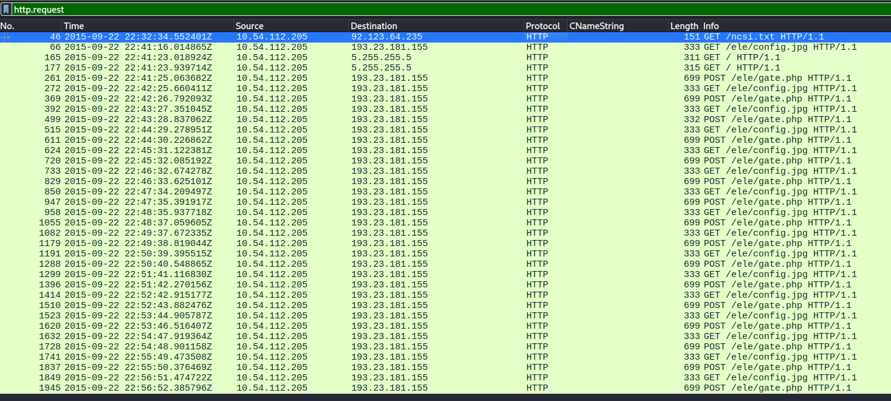

*Every HTTP request in the capture. Three destinations total.*

Excluding the repeating traffic leaves three requests in the entire file.

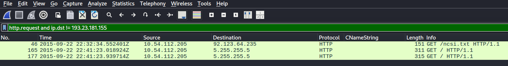

*The only HTTP requests not directed at 193.23.181.155.*

One is Windows' NCSI connectivity check at 22:32:34, which every Windows machine performs on joining a network. The other two go to 5.255.255.5 at 22:41:23, seconds after the repeating traffic starts. There is no browsing, no search, no webmail, no software download and no redirect chain anywhere in the capture.

DNS tells the same story.

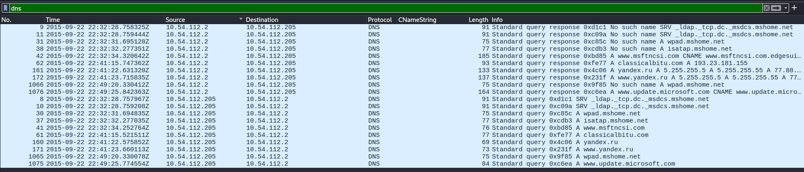

*All DNS queries and responses.*

The four NXDOMAIN responses early in the capture are for `_ldap._tcp.dc._msdcs.mshome.net`, `wpad.mshome.net` and `isatap.mshome.net`. These are standard Windows workgroup lookups on a consumer router handing out an mshome.net suffix, not algorithmically generated domains. They confirm the absence of a domain controller and nothing more.

The one lookup that matters resolves at 22:41:15.

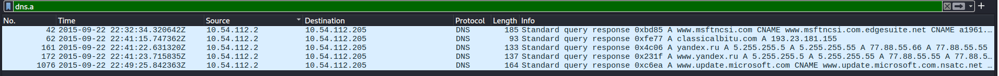

*classicalbitu.com resolving to 193.23.181.155.*

One second later the host makes its first request to that address.

## The command and control channel

From 22:41:16 to the end of the capture the host runs a fixed loop: a GET for `/ele/config.jpg`, then roughly one second later a POST to `/ele/gate.php`, then silence for about a minute before repeating.

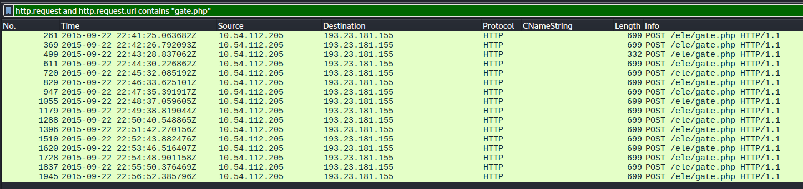

*Sixteen POSTs to /ele/gate.php at approximately 62 second intervals.*

The regularity is the signal. Human browsing is bursty and hits varied destinations with varied sizes. A host issuing the same two requests to the same two URIs on a fixed timer for sixteen consecutive minutes is automated.

Following one of the transactions shows what is moving.

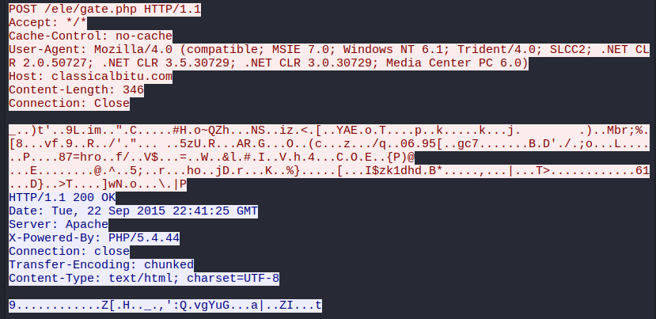

*A routine check-in. 346 byte encrypted request body, server response over Apache with PHP 5.4.44.*

The POST body is binary with no readable structure. The response headers are worth noting for two reasons. The server fingerprint, Apache with PHP/5.4.44, is a useful artifact, and the `Date` header reads 22:41:25 GMT, matching the packet timestamp exactly and independently confirming that the capture timestamps are UTC.

Exporting the HTTP objects and examining the uploaded bodies inside the VM:

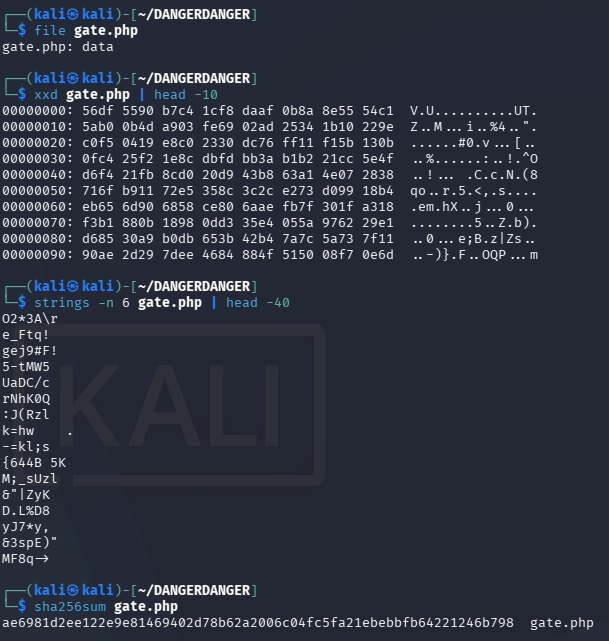

*file reports no recognizable format and strings returns nothing readable. The object shown is the largest of the uploads at 8,480 bytes, covered below.*

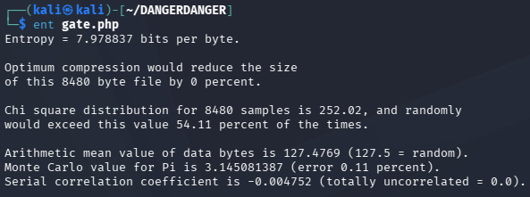

*Entropy of 7.979 bits per byte against a theoretical maximum of 8.*

Plain text measures around 4 to 5 bits per byte and compiled code around 6. A measurement this close to the ceiling means encrypted or compressed content with no remaining structure to recover. The server's replies are equally unreadable, visible as binary following the chunked transfer header in the stream above, so the channel is obfuscated in both directions.

## The image that is not just an image

The repeatedly fetched `config.jpg` is 81 kB and identical on every fetch. A browser caches an image. Something re-requesting the same unchanged file every 62 seconds is not rendering a page.

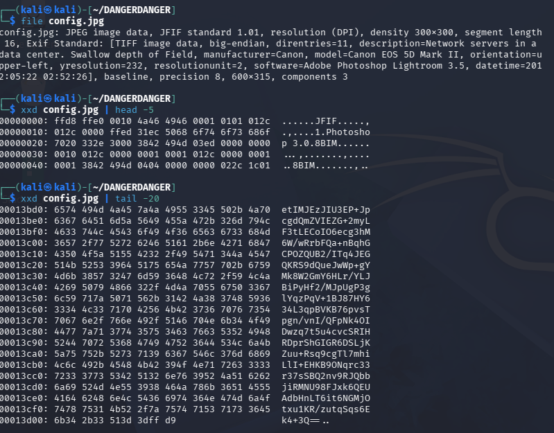

*file identifies a genuine JPEG. The tail shows base64 text ending in padding immediately before the ffd9 end-of-image marker.*

The file is a real photograph with complete and legitimate camera metadata: a Canon EOS 5D Mark II capture from 2011, processed in Lightroom, with intact IPTC attribution and an embedded sRGB color profile. It opens normally in an image viewer. But the last twenty lines before the end-of-image marker are continuous base64 text terminating in `==` padding, and running exiftool accounts for none of it. No XMP, IPTC, Photoshop or ICC segment holds that content. The 16 malformed packets Wireshark flagged in the protocol hierarchy were the dissector reacting to this structural anomaly.

Hashing the carved file and checking the hash:

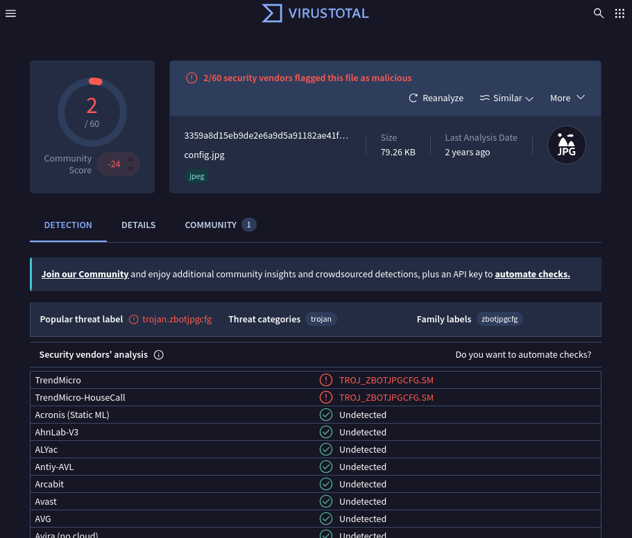

*SHA256 3359a8d1..., popular threat label trojan.zbotjpgcfg, detected by TrendMicro as TROJ_ZBOTJPGCFG.SM.*

The vendor label names the technique directly. This is a Zeus (ZBOT) configuration file carried inside a JPEG. The two of sixty detection rate is itself the finding: a file that opens as a valid photograph, carries authentic camera metadata, and is served with a normal image extension defeats static reputation checks. The behaviour around it is what exposes it.

The domain serving it:

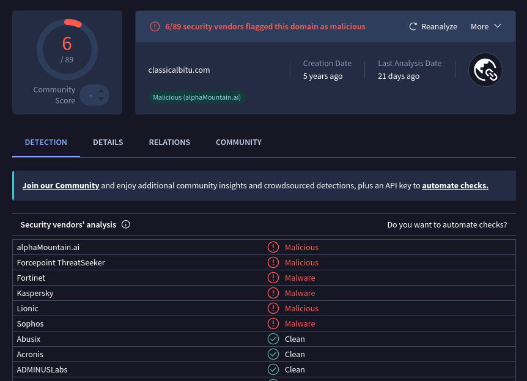

*classicalbitu[.]com, 6 of 89 vendors flagging it as malicious.*

## The outlier

Fifteen of the sixteen check-ins upload a uniform 346 bytes. One does not.

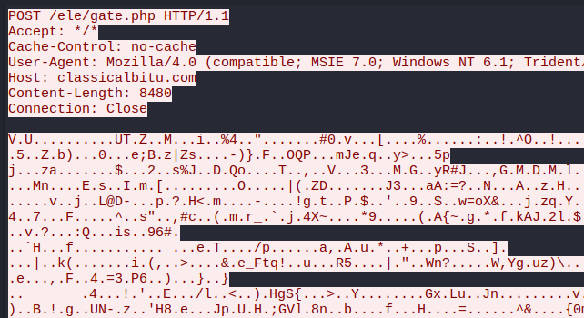

*22:43:28. A POST carrying an 8,480 byte body, roughly 25 times the normal check-in.*

The direction is worth stating plainly, because it is easy to misread a large transfer as a download. This is a POST, and the size is in the request. The data moved from the infected host to the attacker's server. This is the object measured above at 7.979 bits per byte. Its contents cannot be recovered.

What preceded it is the relevant part. Thirty-eight seconds earlier, at 22:42:50, the host issued three NetBIOS name queries for CITIBANK, visible in the NBNS capture above. Those queries sit among otherwise routine WPAD lookups and are the only bank-related activity in the file.

Observed: bank-related name resolution at 22:42:50, followed by an encrypted upload 25 times larger than baseline at 22:43:28. Analysis: this ordering is consistent with a credential stealer capturing data during banking activity and reporting it upstream. The upload contents are encrypted, so the correlation is timing and volume based and cannot be confirmed from the capture alone.

## The two Yandex requests

The remaining unexplained traffic resolves quickly.

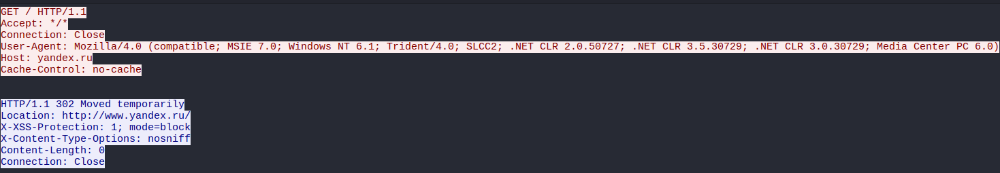

*GET to yandex.ru at 22:41:23, answered with a 302 redirect.*

These carry the same User-Agent as the C2 requests, meaning the same process issued both. They land seven seconds after the first config retrieval and are followed immediately by the first check-in. This is the implant verifying it has working internet access by reaching a large, reliably available site, the same logic behind Windows' own NCSI check. It is startup behaviour, not infection traffic, and yandex.ru is not treated as an indicator here.

## Root cause

The capture does not contain the infection.

The timeline is continuous from the moment the host appeared on the network. DHCP at 22:32:14, NetBIOS registration at 22:32:28, Windows connectivity check at 22:32:34, then nine minutes of ordinary idle behaviour, then the first C2 lookup at 22:41:15. In those nine minutes there is no download, no email, no encrypted session, no redirect and no user-driven web activity of any kind. Protocol Hierarchy confirms the protocols that would carry such a delivery are simply not present in the file.

The malware was already resident on PENDJIEK-PC before recording started. What this capture documents is an established Zeus infection resuming operation once network connectivity became available: retrieving its configuration, verifying internet access, and beginning its check-in cycle.

The initial delivery vector therefore cannot be determined from this evidence. Zeus in this period was distributed predominantly through malicious email attachments and exploit kit drive-by downloads, so one of those is the probable origin, but that is an inference drawn from family identification rather than an observation supported by these packets. Determining it properly would require host-based artifacts: browser history, email client data, prefetch, registry run keys and file system timestamps predating the capture.

## Indicators

| Indicator | Type | Detail |
|---|---|---|
| classicalbitu[.]com | Domain | Zeus C2, VT 6/89 |
| 193.23.181[.]155 | IPv4 | C2 host, Apache / PHP 5.4.44 |
| hxxp://classicalbitu[.]com/ele/config.jpg | URL | Encrypted configuration in a valid JPEG |
| hxxp://classicalbitu[.]com/ele/gate.php | URL | Check-in and exfiltration endpoint |
| 3359a8d15eb9de2e6a9d5a91182ae41f7dda053e78f5e9d3b715ab28afa57ea1 | SHA256 | config.jpg, TROJ_ZBOTJPGCFG.SM |
| Mozilla/4.0 (compatible; MSIE 7.0; Windows NT 6.1; Trident/4.0; SLCC2; ...) | User-Agent | Used for C2 and connectivity check |

Victim: 10.54.112.205, 00:50:8b:01:db:2f, PENDJIEK-PC, Windows 7, workgroup WORKGROUP.

## Tools and commands

Wireshark display filters

```
dhcp
nbns
dns
dns.a
kerberos.CNameString
http.request
http.user_agent
http.request and http.request.uri contains "gate.php"
http.request and ip.dst != 193.23.181.155
http.request and ip.addr == 5.255.255.5
```

File identification and hashing, run inside the isolated VM

```
file config.jpg
file gate.php
xxd config.jpg | head -5
xxd config.jpg | tail -20
xxd gate.php | head -10
strings -n 6 gate.php | head -40
strings -n 40 config.jpg | tail -40
exiftool config.jpg
sha256sum config.jpg
sha256sum gate.php
```

Entropy measurement

```
ent gate.php
```

## Takeaways

The detection opportunities here are all behavioural, and none of them require knowing what Zeus is.

Fixed-interval outbound requests are the strongest signal in this capture. Sixteen POSTs at roughly 62 second spacing to a single URI, with no referring page and no accompanying page assets, is not something a browser produces. Beacon periodicity detection catches this without any prior knowledge of the family, the domain or the payload, which matters because the domain scored 6 of 89 and the payload file scored 2 of 60. Reputation alone would have missed it.

Repeated retrieval of an identical static object deserves attention on its own. An 81 kB image fetched unchanged every minute, with no HTML, CSS or other resources requested alongside it, is a malformed page load at best. Here it was a configuration channel.

Protocol anomalies are worth reading rather than dismissing. Wireshark flagged 16 malformed JPEG packets in the protocol hierarchy before any file was carved, and that was the dissector correctly reacting to data embedded in the image. A file type that parses as valid but fails structural validation is a useful hunting pivot.

For prevention, egress filtering and DNS filtering would have broken this chain at the first lookup, since the host had no legitimate reason to resolve or reach that domain. Outbound POST volume monitoring would have flagged the 8,480 byte upload against a 346 byte baseline. Neither requires identifying the malware first. Both work on the shape of the traffic rather than its contents, which is the only option available once the channel is encrypted, as it was here in both directions.