# Ransomware Attack

This exercise provides a Windows 10 disk image from a workstation with an active ransomware infection. The task is to document the suspicious activity present on the system, determine what happened to the user's files, identify the family responsible, and then recover the data and remove the malware.

Analysis was done inside an isolated VM on KVM. The network adapter was removed from the guest before first boot, so the sample had no path off the machine for the entire investigation. The binary was hashed inside the VM and only that hash was looked up externally. Nothing was extracted to the host and nothing was executed outside the guest.

## First Boot

The image boots straight to a desktop with a window already open.

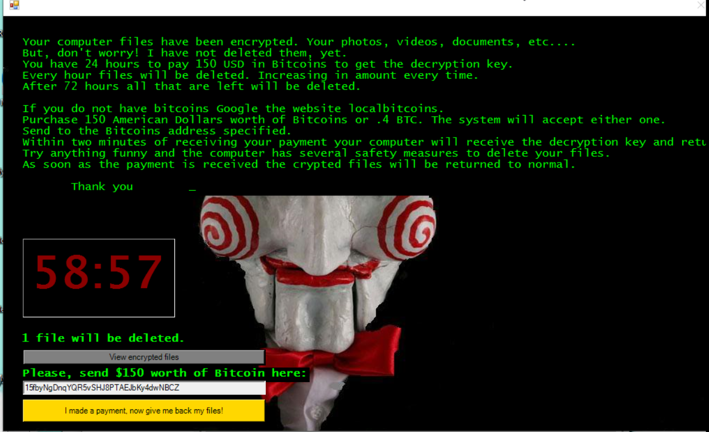

*Ransom demand displayed on startup, with a live countdown timer*

The message claims all photos, videos and documents have been encrypted and asks for 150 USD in Bitcoin within 24 hours, to the address `15fbyNgDnqYQR5vSHJ8PTAEJbKy4dwNBCZ`. Below the text a timer counts down, and under it a line states that one file will be deleted when it expires, with the number increasing each cycle. After 72 hours everything remaining is destroyed.

The timer is a live thread in the running process rather than a static image, and the desktop wallpaper has been replaced. The countdown is a pressure mechanism aimed at the user, designed to force payment before anyone looks closely at the system.

## Locating the Process

Task Manager shows two processes grouped under a single entry.

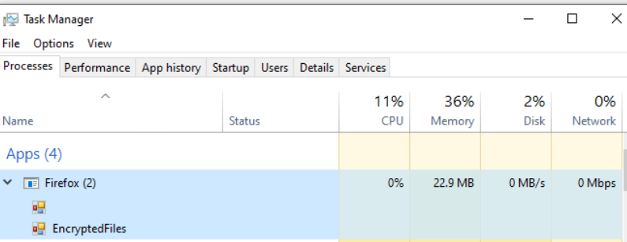

*Firefox (2), with a child process named EncryptedFiles*

A browser parent with a child called EncryptedFiles is the anomaly. The child name is obvious once seen, but it is nested under a parent that reads as ordinary, which is what a quick scan of the process list would catch.

Opening the file location puts the binary outside any install directory.

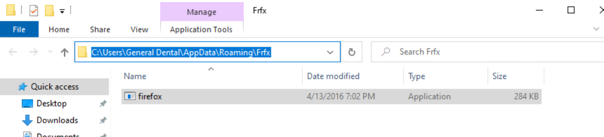

*firefox.exe running from C:\Users\General Dental\AppData\Roaming\Frfx*

Three things here disagree with the claim. Firefox does not install to a user's roaming profile, it does not install to a three-letter folder, and it is not 284 KB. A real installation is several hundred megabytes across dozens of files.

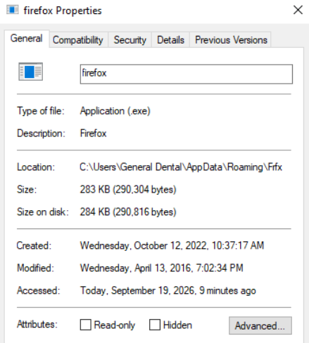

*Created 10/12/2022 10:37:17 AM, modified 4/13/2016 7:02:34 PM*

The creation timestamp matters for the file analysis below. The modified timestamp is the build date carried over from compilation, which places the sample itself in 2016.

## Identifying the Malware

The version metadata gives it away before any external lookup.

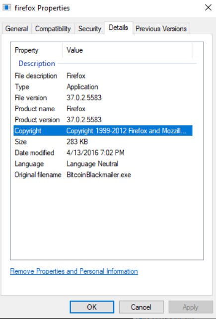

*Product name Firefox 37.0.2.5583, original filename BitcoinBlackmailer.exe*

The file description, product name, version and copyright string are all set to impersonate Mozilla Firefox. The Original filename field underneath reads `BitcoinBlackmailer.exe`, which is the build output name the author never cleared. Observed fact: the PE version resources contain contradictory identity information. Analysis: the file is deliberately masquerading as a browser. That is still not an identification, so the binary was hashed.

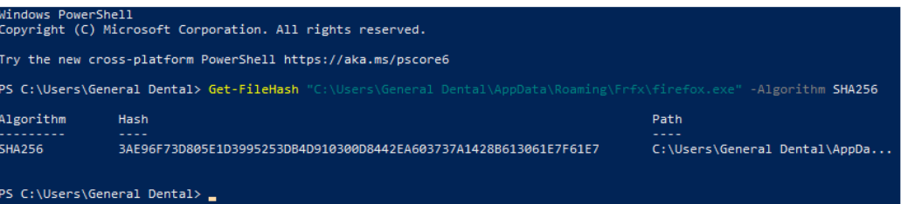

*Get-FileHash run against the binary inside the guest*

```
3AE96F73D805E1D3995253DB4D910300D8442EA603737A1428B613061E7F61E7
```

The hash was read off the screen and searched from the host. Nothing was uploaded.

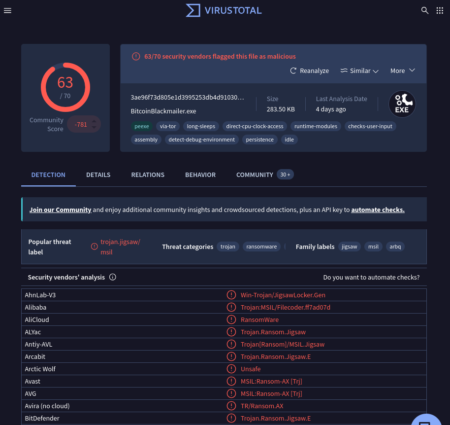

*63 of 70 vendors flagging the sample, popular threat label trojan.jigsaw/msil*

Sixty-three detections, family labels including `jigsaw` and `msil`, and vendor verdicts running from JigsawLocker.Gen to Trojan.Ransom.Jigsaw.E. The submission filename on VirusTotal matches the original filename found locally, so this is the same build rather than a related sample. The `msil` label confirms .NET, which matches the 283 KB size.

Confirmed finding: the malware is **Jigsaw**, a .NET ransomware family first seen in 2016, named for the imagery it borrows and known for its file-deletion timer rather than for cryptographic strength.

## What Happened to the Files

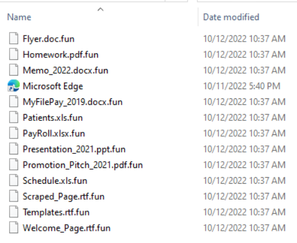

*Twelve encrypted files, each with .fun appended*

Twelve desktop files were encrypted, with `.fun` appended to each existing name. `PayRoll.xlsx` became `PayRoll.xlsx.fun` and `Patients.xls` became `Patients.xls.fun`. Appending the extension breaks the file association, so Windows drops every icon to the generic blank-page default.

Filenames and directory structure are otherwise untouched, which limits the impact to file contents plus one appended extension and is also what makes automated recovery viable.

Every encrypted file carries a modified timestamp of 10/12/2022 10:37 AM. The binary in AppData was created at 10:37:17 AM the same day. Encryption ran within seconds of the executable reaching disk, placing delivery and execution in the same moment rather than a dormant period followed by a trigger.

The Microsoft Edge shortcut on the same desktop is untouched, which is consistent with a target extension list covering documents rather than indiscriminate encryption of everything present.

## Recovery

Jigsaw verifies payment itself rather than waiting on instructions from a server. Jigsaw Puzzle Solver, published through the No More Ransom project, exploits this by standing up a local listener and answering the malware's own payment check with a confirmation. The ransomware then decrypts the files under the belief that the ransom was paid.

The tool was carried into the guest on read-only media. Nothing writable was shared with the infected machine at any point, which also meant the ransomware had no path to the recovery tool.

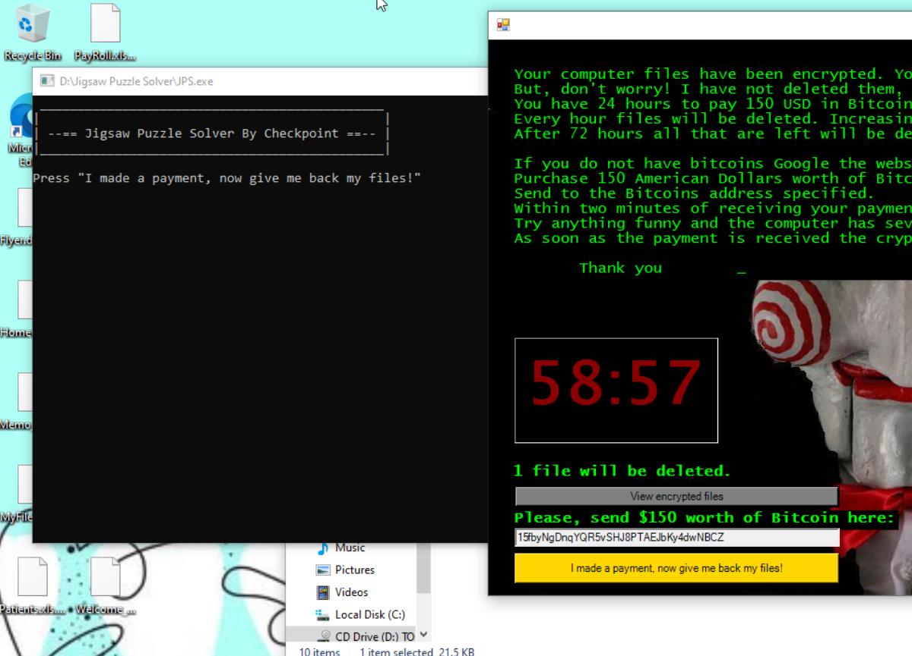

*Jigsaw Puzzle Solver launched from read-only media, ransom window still active*

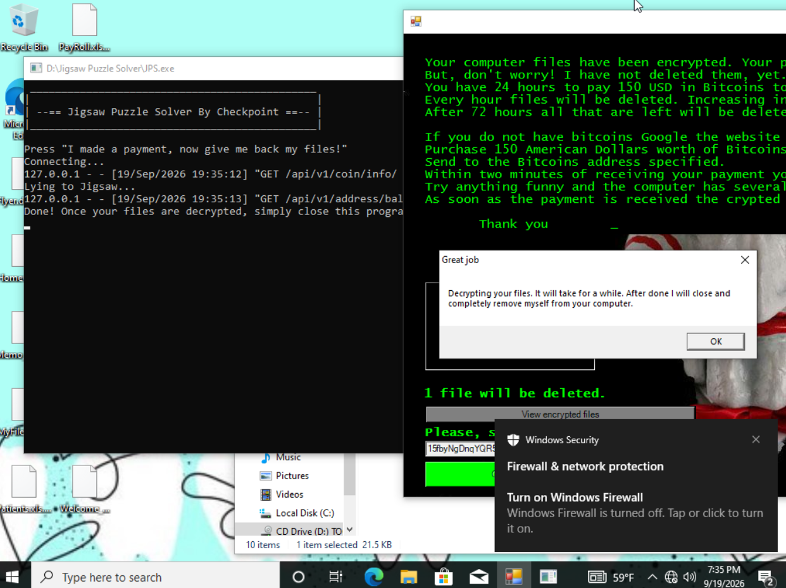

*Two requests answered on 127.0.0.1, followed by Jigsaw's own response*

The console shows a coin info request and an address balance request, both answered locally, and the tool's own note that it is lying to Jigsaw. The malware accepted the response and produced a dialog stating it would decrypt the files and then remove itself from the computer.

That claim was verified rather than taken at face value. Afterwards the `Frfx` folder was empty, no Firefox processes remained, and a reboot produced no ransom window and no new `.fun` files. Removal was carried out by the malware's own routine under false pretenses, not by manual deletion, which is worth stating precisely because it changes what the evidence proves.

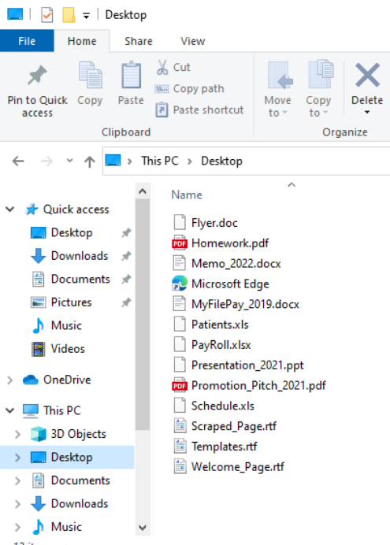

*Desktop after decryption, with original extensions and file associations restored*

All twelve files were recovered with icons and associations back to normal. The countdown had not reached zero, so nothing was lost to the deletion timer.

Also visible in the decryption screenshot is a Windows Security notification reporting that the firewall is turned off. Whether that predates the infection or resulted from it cannot be determined without examining event logs, but a workstation in this state is a finding regardless of cause.

## Root Cause

The workstation was compromised by Jigsaw ransomware executing from the user's roaming profile. The binary required no administrative rights and no exploit. It ran from a directory the logged-in user can write to, then encrypted the user's documents within seconds of landing.

How it reached the host cannot be determined from this evidence. The image was provided already infected, and no email client data, browser history, prefetch entries or registry run keys were examined. Jigsaw of this period was distributed mainly through malicious email attachments and file-sharing sites, which is the likely route, but the evidence available here does not establish it.

## Indicators of Compromise

| Type | Value | Role |
|---|---|---|
| SHA256 | `3AE96F73D805E1D3995253DB4D910300D8442EA603737A1428B613061E7F61E7` | Jigsaw ransomware binary, VT 63/70 |
| Filename | `firefox.exe` | Masquerading as Mozilla Firefox 37.0.2.5583 |
| Original filename | `BitcoinBlackmailer.exe` | PE version resource, build output name |
| Path | `C:\Users\General Dental\AppData\Roaming\Frfx\` | Drop location |
| File size | 290,304 bytes | 283 KB, .NET assembly |
| Process names | `firefox.exe`, `EncryptedFiles` | Parent and child, running pair |
| Extension | `.fun` | Appended to encrypted files |
| BTC address | `15fbyNgDnqYQR5vSHJ8PTAEJbKy4dwNBCZ` | Ransom payment destination |
| Timestamp | `2022-10-12 10:37:17` | Binary creation, matches file encryption time |

Victim host: user account General Dental, Windows 10.

## Tools and Commands

Hash the suspect binary, run inside the isolated guest

```powershell
Get-FileHash "C:\Users\General Dental\AppData\Roaming\Frfx\firefox.exe" -Algorithm SHA256
```

The remaining work was Task Manager for the process tree, File Explorer properties for the binary metadata and timestamps, a VirusTotal hash search from the host, and Jigsaw Puzzle Solver for recovery.

## Takeaways

The detection opportunities here do not require knowing what Jigsaw is.

Execution from `%AppData%\Roaming` is the strongest signal in this incident. An executable running out of a user-writable profile directory, in a folder no installer created, is abnormal on a workstation. Application allowlisting or a path-based execution rule stops this before a single file is encrypted, and it works without any prior knowledge of the family or the hash.

The masquerade only survives a glance. Product metadata can be set to anything the author wants, but the file's size, its location and the leftover build name in the PE header all contradicted the claim. Three checks, no tooling. When a process claims to be something familiar, verifying where it actually lives is the cheapest disproof available.

Identification never depended on the ransom note. Notes are the easiest artifact for an author to edit, and a modified note defeats matching against known text. Version metadata and a file hash both come from the binary itself, and here they agreed.

On recovery, the order of operations decided the outcome. Jigsaw is beatable because it performs its payment check locally, which is a flaw specific to this family and not a general property of ransomware. Modern families hold the key on infrastructure the victim cannot reach. What generalizes is the sequence: identify the family precisely, check whether a free decryptor exists, and only then touch the system. Running an antivirus cleanup first would have deleted the binary along with the routine that made decryption possible, and the files would have stayed encrypted.

For prevention, application control addresses the execution path directly and endpoint protection with current signatures would flag a sample this widely detected. Offline backups make the ransom mechanism irrelevant entirely, which is the only control that holds against families with no public decryptor.