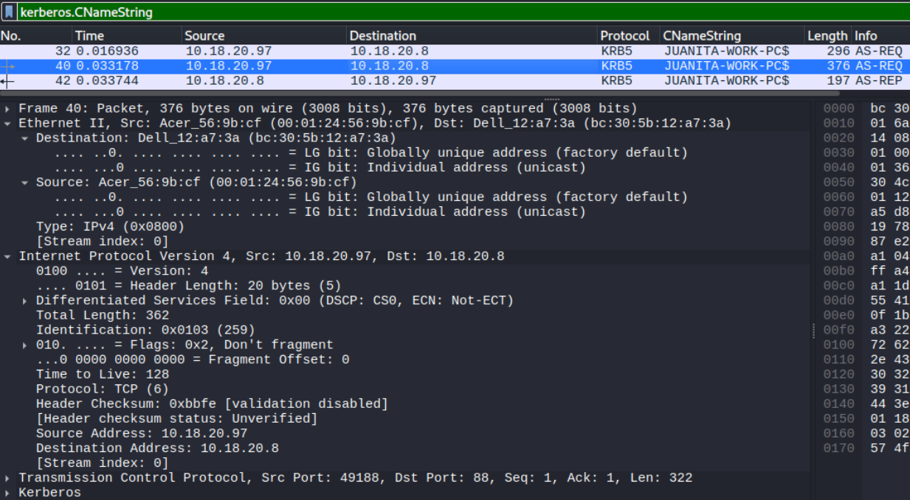
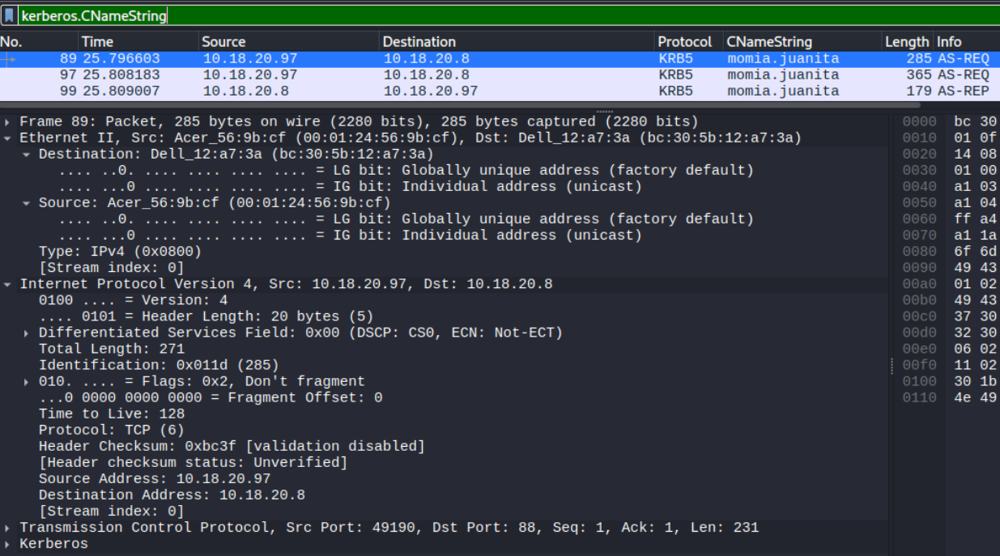
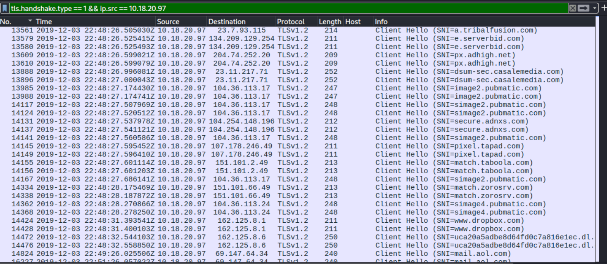
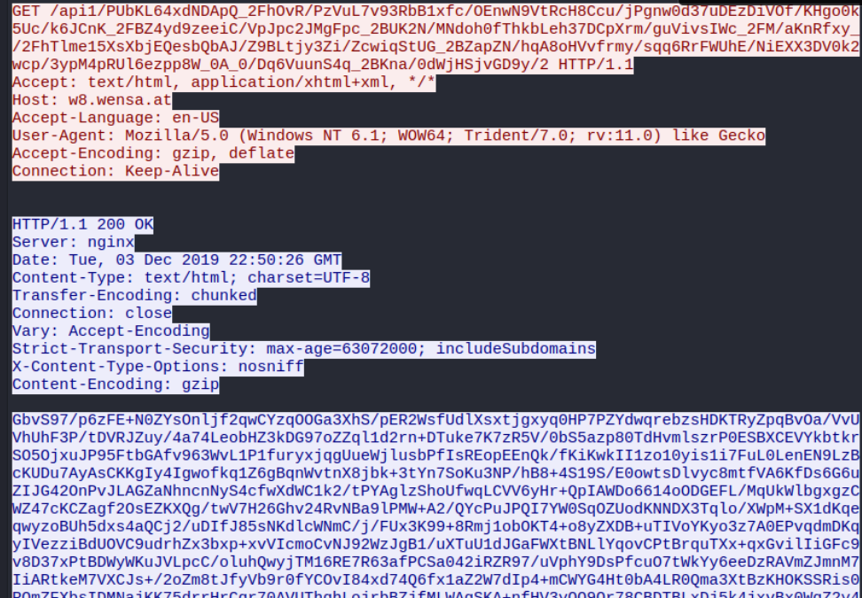
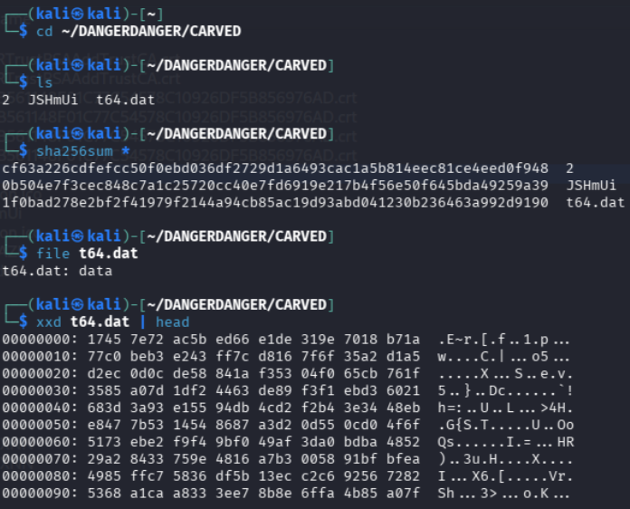
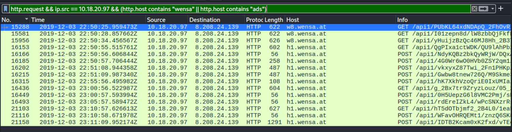
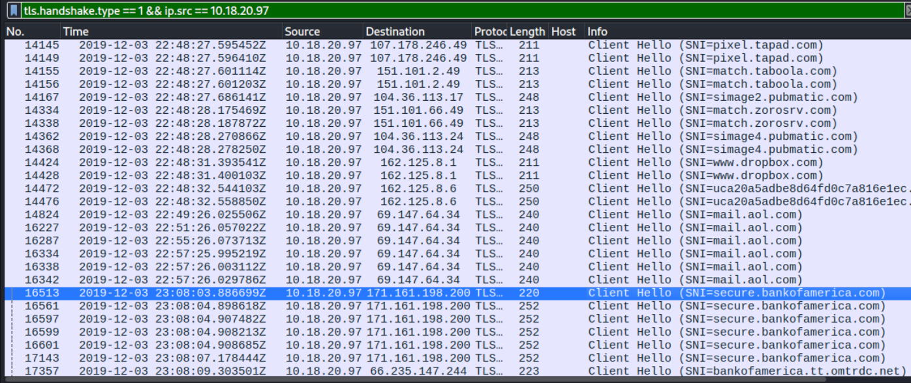

# Ursnif Infection Traffic Analysis

This exercise provides a packet capture and an accompanying IDS alert export from an Active Directory network, documenting a single Windows host infected with the Ursnif (Gozi/ISFB) banking trojan. The task was to identify the infected host and user, name the malware and where it came from, and determine what the victim did afterward, working from the capture and its alerts alone.

Analysis was done in an isolated Kali Linux VM on KVM, reverted to a clean snapshot with the network link disabled before the archive was extracted. The capture was read in Wireshark. The objects carved from it were hashed inside the VM, and only the hashes were looked up on VirusTotal from the host. Nothing was extracted or executed.

## Reading the Alerts First

The alert export scopes the whole incident before any packet is opened. Almost every event involves 10.18.20.97, and the one line that names malware fires twice: `ETPRO TROJAN Ursnif Variant CnC Beacon 12` (M1 and M2), on traffic from 10.18.20.97 outbound to 8.208.24[.]139 on port 80. A beacon is the infected host calling home, so that direction makes 10.18.20.97 the victim and 8.208.24[.]139 the C2. The remaining alerts are Active Directory noise between 10.18.20.97 and 10.18.20.8 on LDAP, Kerberos and DNS, which marks the second host as the domain controller rather than a second victim. Everything after this is confirming the alert against the packets and filling in the details the alert does not carry: the host's MAC and name, the user, the delivery, and the aftermath.

## Identifying the Host and User

Kerberos authentication carries the machine and user identities in cleartext, so a single `kerberos.CNameString` filter returns both. The machine account `JUANITA-WORK-PC$`, with its trailing `$`, gives the hostname, and it originates from source MAC 00:01:24:56:9b:cf (Acer) on the same AS-REQ frame as source IP 10.18.20.97, which ties the MAC to the host rather than to the gateway or the DC.



*JUANITA-WORK-PC$ authenticating from 10.18.20.97, source MAC 00:01:24:56:9b:cf.*

The user principal `momia.juanita`, without the `$`, is the account logged into that host. The host's own HTTP requests report a User-Agent of `Windows NT 6.1; WOW64; Trident/7.0; rv:11.0`, which is Windows 7 running Internet Explorer 11.



*The same host authenticating the user account momia.juanita.*

That gives the infected client: momia.juanita on JUANITA-WORK-PC, 10.18.20.97, MAC 00:01:24:56:9b:cf, Windows 7.

## How the Malware Arrived

Reading the host's web activity against the clock reconstructs the delivery. The first request is a GET to mail.aol.com at 22:45:55, consistent with the user opening a message in webmail. Most of what follows is HTTPS, so the redirect path shows up only in the TLS handshakes, where the SNI field of each Client Hello is cleartext. Filtering on `tls.handshake.type == 1` exposes a burst of ad-network domains at 22:48:26 (pubmatic, adnxs, casalemedia, tribalfusion, taboola, tapad) leading into www.dropbox.com and a random-subdomain `*.dl.dropboxusercontent.com` link at 22:48:31. That ad-redirect-into-cloud-storage chain is the staging path between the opened email and the payload.



*Ad-network SNI burst leading into the Dropbox staging link.*

Seconds later, at 22:50:25, the host makes its first plaintext HTTP request, a GET to a long random `/api1/` path on w8.wensa[.]at. Following that stream, the server returns a `200 OK` with `Content-Type: text/html` whose body is a single line of high-entropy base64, not a web page. That fake HTML is the encoded payload and C2 data, and the C2 IP behind it is the same 8.208.24[.]139 the alert flagged.



*GET /api1/<random> to w8.wensa[.]at and its encoded text/html response.*

## Confirming the Malware

Exporting HTTP objects surfaces three substantial transfers: `2` (260 KB) and `JSHmUi` (327 KB) from w8.wensa[.]at, and `t64.dat` (138 KB, `application/octet-stream`) from api2.casus[.]at. All three carve to `file: data` with no MZ/PE header and near-maximal entropy, and none are known to VirusTotal, because they are the on-wire encoded transport rather than a runnable binary. No clean sample hash is recoverable from this capture, so identification rests on the IDS signature and the traffic behavior, which agree.



*The carved payload is encoded: no PE header, high-entropy bytes.*

The behavior is textbook Ursnif and matches the signature: random `/api1/` GET URIs, fake `text/html` responses, and `multipart/form-data` POSTs uploading data back to h1.wensa[.]at, all resolving to the single C2 address 8.208.24[.]139. The GET-then-POST loop runs on a repeating interval from 22:50 onward, the retrieval and exfiltration channel of an established info-stealer.



*Retrieval GETs and encoded multipart POSTs to 8.208.24[.]139.*

## What the Victim Did Afterward

Roughly eighteen minutes after the payload landed, at 23:08:03, the host opens a TLS session to secure.bankofamerica.com. The connection to an online-banking site is visible by SNI; the session itself is encrypted, so credential theft during that visit is consistent with an Ursnif infection but is not directly provable from the capture. The ordering is the point: the host is infected and beaconing, and then the user logs into their bank.



*Post-infection TLS connection to secure.bankofamerica.com at 23:08:03 UTC.*

## Indicators of Compromise

| Type | Value | Role |
|---|---|---|
| Victim host | JUANITA-WORK-PC, 10.18.20.97, MAC 00:01:24:56:9b:cf | Infected client (user momia.juanita), Windows 7 |
| C2 / distribution IP | `8.208.24[.]139` | Beacon, payload, and exfil, port 80 |
| Domain | `w8.wensa[.]at` | Payload GET, encoded text/html C2 |
| Domain | `h1.wensa[.]at` | multipart/form-data exfil |
| Domain | `api2.casus[.]at` | octet-stream transfer (t64.dat) |
| URI pattern | `/api1/<random>` | GET retrieval and POST exfil |
| Staging | `*.dl.dropboxusercontent[.]com` | Cloud-hosted staging link off an ad-redirect chain |
| Object | t64.dat | `1f0bad278e2bf2f41979f2144a94cb85ac19d93abd041230b236463a992d9190` (encoded, unknown to VT) |
| Family | Ursnif / Gozi / ISFB | Banking trojan |

## Tools and Commands

Wireshark display filters

```
kerberos.CNameString
http.request && ip.src == 10.18.20.97
http.request && ip.src == 10.18.20.97 && http.host contains "aol"
tls.handshake.type == 1 && ip.src == 10.18.20.97
```

Object carving and triage, run inside the isolated VM

```
sha256sum 2 JSHmUi t64.dat
file t64.dat
xxd t64.dat | head
```

## Takeaways

The infection is visible at several points a defender already monitors, and none of them require knowing what Ursnif is.

- Kerberos `CNameString` scopes an AD incident quickly. Pairing the source MAC and IP on a single AS-REQ frame attributes the host without grabbing the gateway or DC address by mistake, and it is what tells you which asset and which user to isolate first.
- A single IDS hit is a lead, not a verdict. The Ursnif label held here because the beacon destination, the random `/api1/` URIs, the fake `text/html` responses, and the multipart exfil all corroborated it. Confirming the signature against behavior is the discipline, especially when the carved payload is encrypted and unknown to reputation services.
- The fixed GET-then-POST loop to a single hardcoded IP is a beacon pattern detectable on periodicity alone, independent of the domain or payload reputation.

On the prevention side: monitor TLS SNI for both the ad-redirect delivery chain and the post-infection banking connection, apply egress filtering to break C2 to a single hardcoded address, and restrict script and macro execution so a webmail-delivered lure cannot stage its payload in the first place.