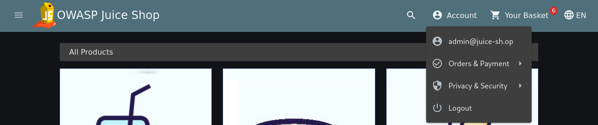
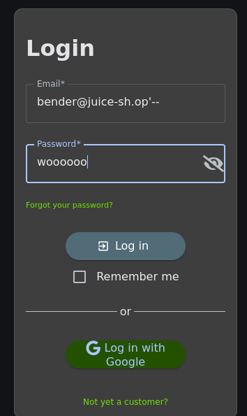
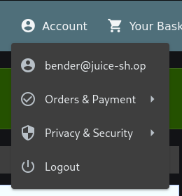

# Offensive 1.2: User Log In

Chained the admin access from 1.1 with user enumeration to log in as a specific non-admin account (Bender) via SQL injection.

The login form is injectable the same way it was in 1.1, but this story requires targeting a specific user rather than just landing on the first row in the users table. That means finding a real user email first, then crafting a payload that authenticates as that specific account.

With admin access from 1.1 still active, browsed the shop and found that product reviews expose the reviewer's email address in plaintext. Banana Juice's review was left by `bender@juice-sh.op`, giving both confirmation of the shared `juice-sh.op` email domain and the exact target account.

## Payload used in the email field:
```
bender@juice-sh.op'--
```
This closes the email string right after the target address and comments out the password check entirely, so the WHERE clause resolves to `email = 'bender@juice-sh.op'` with no password condition. The app logged in as Bender and the "Login Bender" challenge flag fired.

Two chained weaknesses made this trivial: views exposed user PII (email addresses in reviews) that shouldn't have been visible even to admins, and the login query was still concatenating input into SQL. Fixing either one alone would have made this attack noticeably harder.

Admin session from 1.1 used for enumeration:



Bender's email exposed in a product review:


Payload entered in email field:



Login Bender challenge flag:

