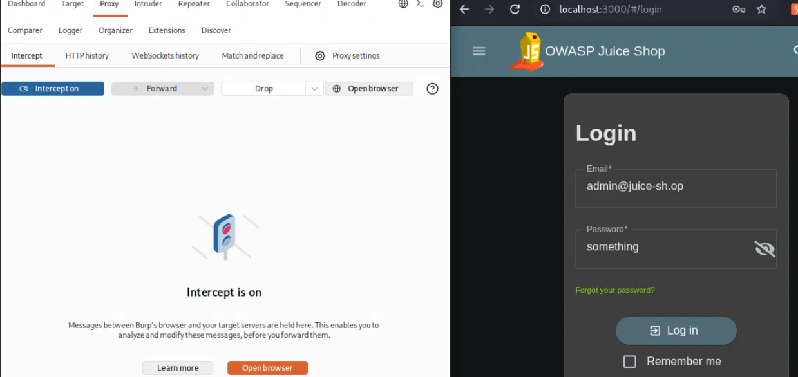
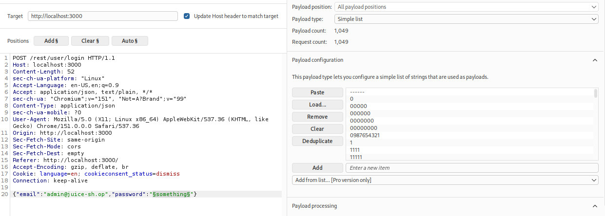
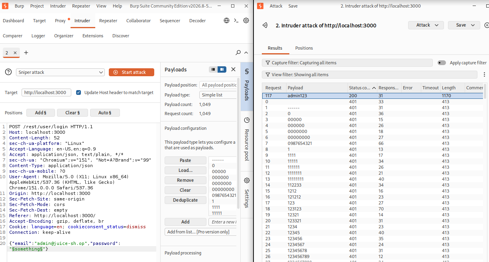
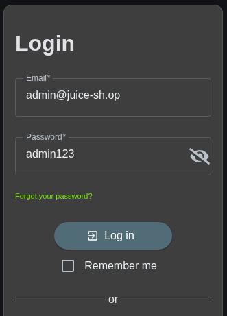
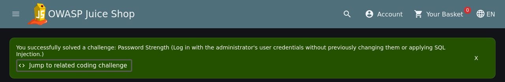

# Offensive 2: Reset Admin Password

Brute-forced the admin account's password using Burp Suite's Intruder with SecLists' `best1050.txt` wordlist, logged in with the recovered credentials, then reset the password from the account settings page.

Sent a login attempt from Burp's built-in browser through the proxy with dummy credentials, then forwarded the intercepted request to Intruder. In the Positions tab, cleared the default markers and wrapped just the password value in `§` markers so Intruder would only substitute that field. Loaded `best1050.txt` from `/usr/share/seclists/Passwords/Common-Credentials/best1050.txt` (installed via `apt install seclists`) as a simple list payload.

Ran the attack with Sniper mode. Burp Community Edition rate-limits Intruder, so this took a while but finished cleanly. Failed attempts returned HTTP 401 with a response length of 413 bytes. Request 117 stood out: HTTP 200, length 1170. That was the hit.

Old password: `admin123`
New password: `h4x3d`

With the recovered password, logged in as admin and changed the password through the Privacy & Security settings. The "Password Strength" challenge fires on successful login with the original weak password without SQLi, not on the reset itself, so the flag banner appeared right after logging in with `admin123`.

The real finding here is that the admin account was protected by a password appearing in a public common-passwords list, with no lockout, no rate limiting server-side, and no MFA. Fix priorities: enforce strong password policy on admin accounts, add server-side rate limiting or account lockout after N failed attempts, require MFA for administrative access.

Intercepted login request in Intruder:

Intruder configured with `§` marker on the password field and `best1050.txt` loaded:

Intruder result showing request 117 (`admin123`) with HTTP 200 and outlier length:

Login with recovered credentials:

Password Strength challenge flag:

Admin password successfully changed:

