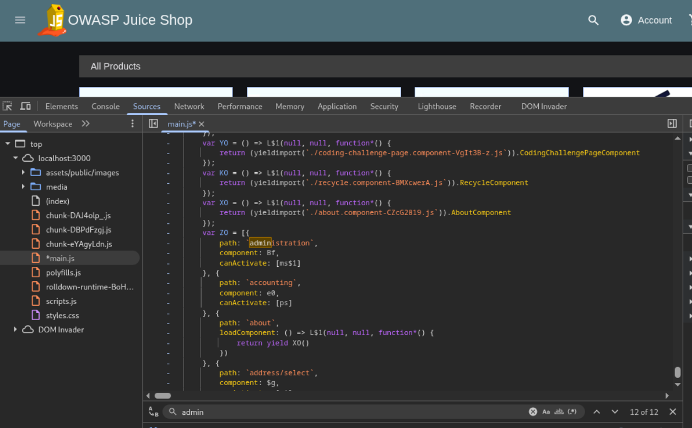
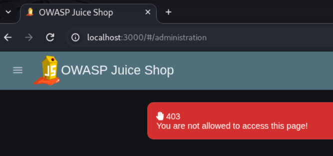
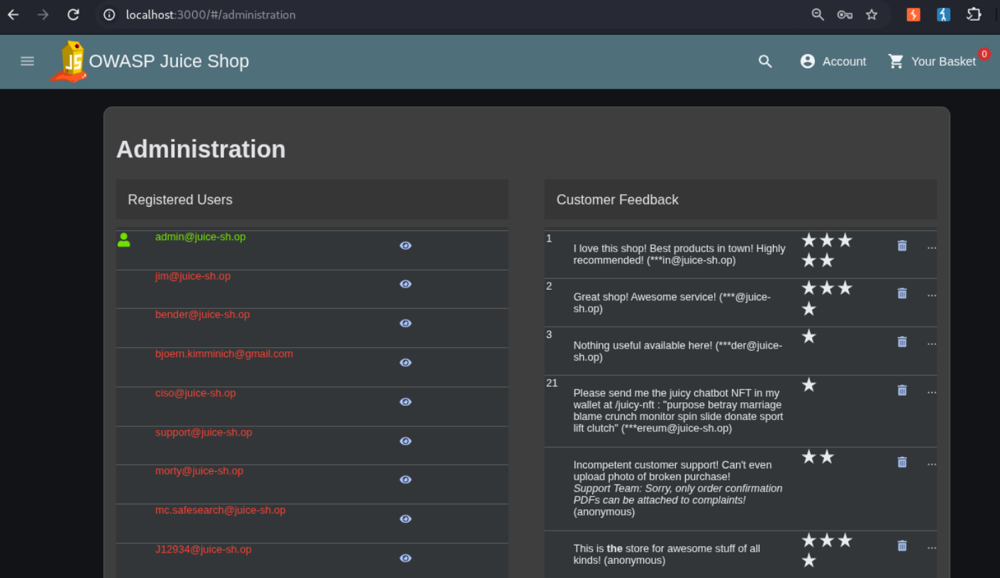
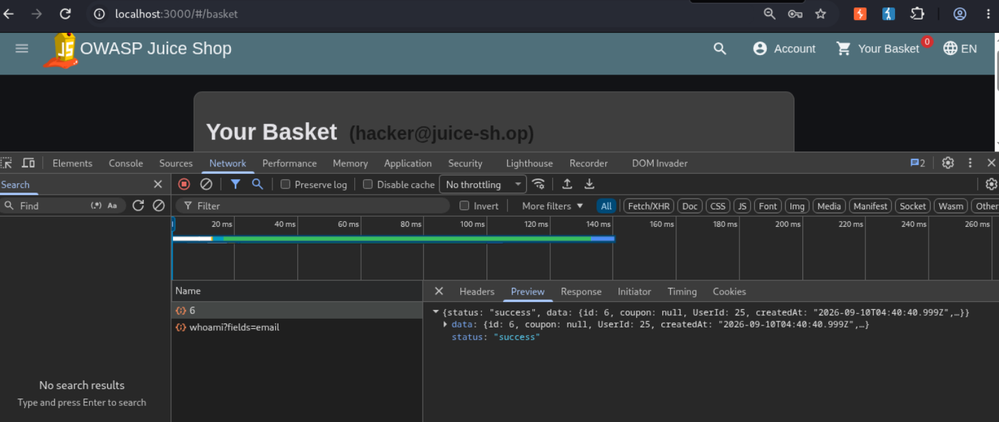
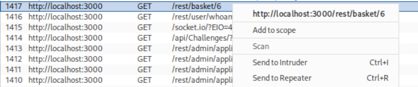
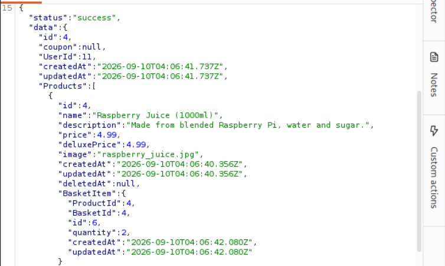
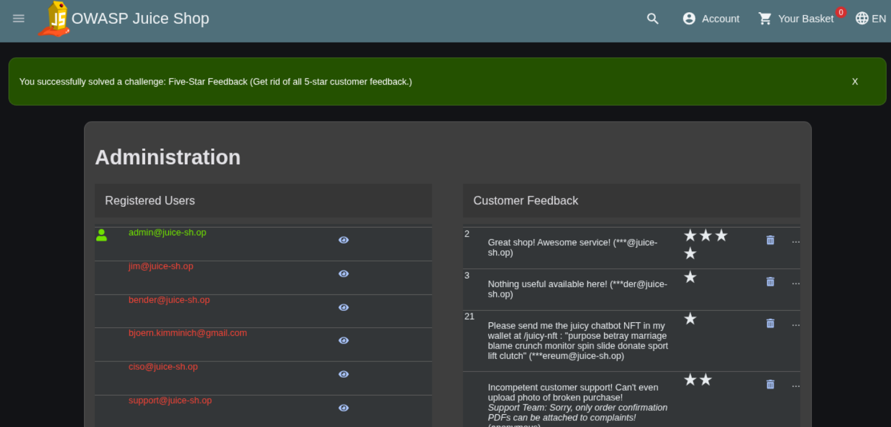

# Offensive 4: Admin Page

Located a hidden administration route in the Juice Shop client-side application, used it to access another user's shopping basket via IDOR, and deleted all five-star reviews from the admin panel.

Juice Shop is an Angular single-page application, meaning every frontend route is shipped to the browser inside its JavaScript bundle. Routes that aren't linked from the UI are still defined in the bundle and just aren't surfaced. Opened dev tools in Burp's built-in browser, navigated to the Sources tab, opened `main.js`, and pretty-printed it. Searched for `admin` and found a route definition:

```
path: "administration"
```

Navigating to `http://localhost:3000/#/administration` returned a 403 "You are not allowed to access this page." The route exists client-side but is guarded server-side by a role check. Logged in with the administrator-role account created in Story 3, then reloaded the administration page. The admin panel loaded, displaying a Registered Users list and a Customer Feedback section with every product review across the app.

To access another user's basket, first identified own basket ID by clicking "Your Basket" and watching the Network tab, which showed a request to `/rest/basket/6` returning `UserId: 25` (own account). Found that request in Burp's HTTP history and sent it to Repeater. Changed the URL path from `/rest/basket/6` to `/rest/basket/4` and clicked Send. The server returned another user's basket contents (basket ID 4, belonging to a different UserId, containing Raspberry Juice). The server checks the session is authenticated but does not verify that the basket being requested actually belongs to the authenticated user. This is a classic IDOR (Insecure Direct Object Reference), OWASP Top 10 A01 Broken Access Control.

From the admin panel, deleted every 5-star review by clicking the trash icon next to each entry in the Customer Feedback section. The "Five-Star Feedback" challenge flag fired.

Three findings chained in this story: an administrative route exposed in client-side code with only role-based guarding on the server, IDOR on the basket endpoint that lets any authenticated user retrieve any basket by ID, and admin-only functionality (deleting reviews) reachable through that same panel. Remediation: strip or obfuscate sensitive route names from client-side bundles as defense in depth (real fix is server-side authorization on every request), enforce object-level ownership checks on every basket read (verify the requesting user's session ID matches the basket owner), and rate-limit administrative destructive actions like bulk review deletion.

Administration route found in main.js:



Direct navigation to /#/administration returns 403 before admin login:



Admin panel loaded after logging in as admin:



Own basket request in Network tab showing UserId 25:



Send basket request to Repeater:



Repeater response after changing basket ID, returning another user's basket contents:



Five-Star Feedback challenge flag after deleting all 5-star reviews:

