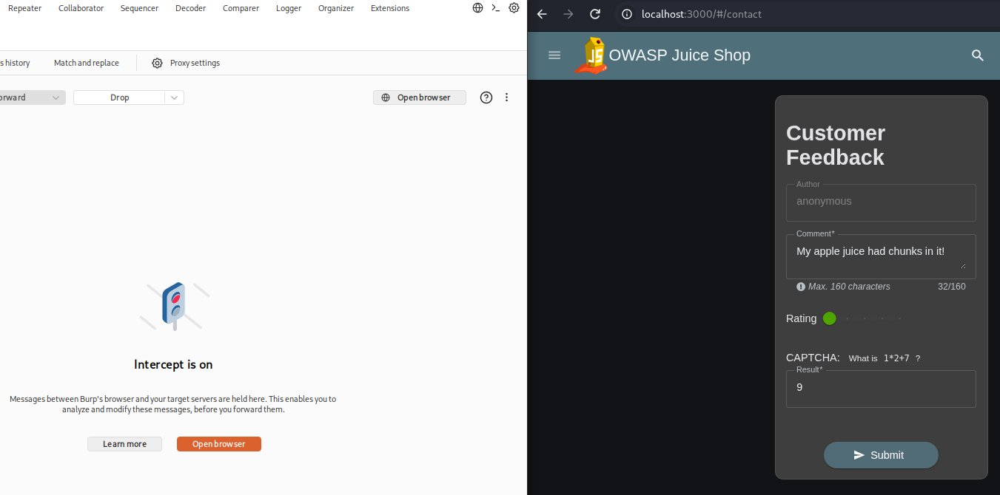
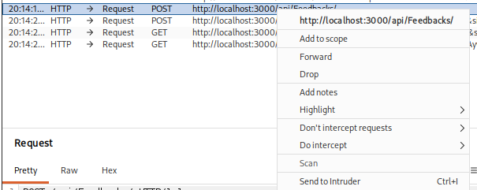
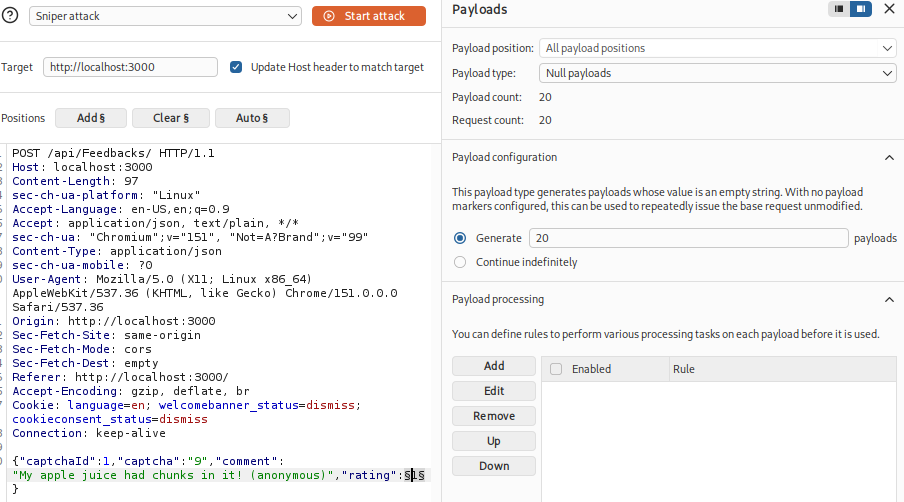
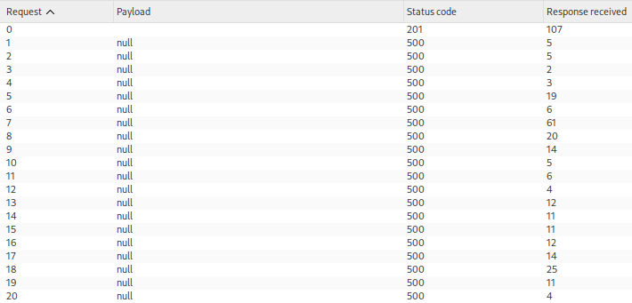
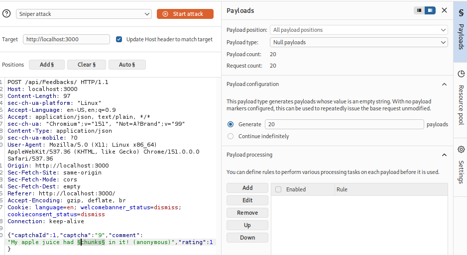
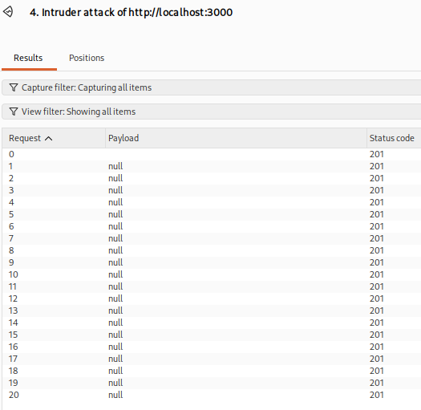
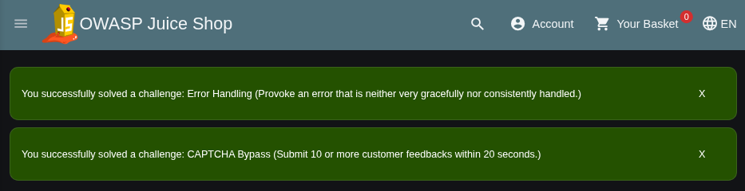

# Offensive 5: CAPTCHA Exploit

Abused the customer-feedback CAPTCHA in OWASP Juice Shop by replaying a single solved CAPTCHA dozens of times, solving the "CAPTCHA Bypass" challenge. The CAPTCHA is a server-generated math question, but the server never invalidates a `captchaId` after it is used and applies no rate limiting to feedback submission, so one valid solve can be reused indefinitely.

Opened the feedback form, filled in a comment and rating, and solved the math CAPTCHA once. With Burp's Intercept on, submitted the feedback and captured the `POST /api/Feedbacks/` request. The request body carries `captchaId` and `captcha` (my solved answer) alongside the comment and rating.

Feedback form with the CAPTCHA to solve:

Confirmed the CAPTCHA was reusable by replaying the captured request in Repeater a few times: every send returned `201 Created` with the same `captchaId` and answer, proving the server does not consume the CAPTCHA on use. Then sent the request to Intruder to automate the flood.

Sending the captured request to Intruder:

## Flooding the feedback endpoint

Used a Sniper attack with a Null payloads set to resend the base request unchanged. Null payloads require a payload position, but the marked value is left blank on each request, so marker placement matters. My first attempt marked the `rating` value, which the null payload blanked to `"rating":`, breaking the JSON and returning `500` on every request after the first.

First config with the marker on `rating` (the broken approach):

Result: one `201`, then `500` errors from the malformed body:

Moved the marker onto a throwaway character inside the comment string instead, so blanking it left valid JSON:

Ran the attack and all requests returned `201 Created`, well over the 10-in-20-seconds threshold:

Back in Juice Shop, the "CAPTCHA Bypass" challenge solved:

The fix is to invalidate each `captchaId` on first use so a solved CAPTCHA cannot be replayed, and to rate-limit feedback submission per session or IP. A CAPTCHA that never expires and an endpoint with no throttling together defeat the entire anti-automation control.