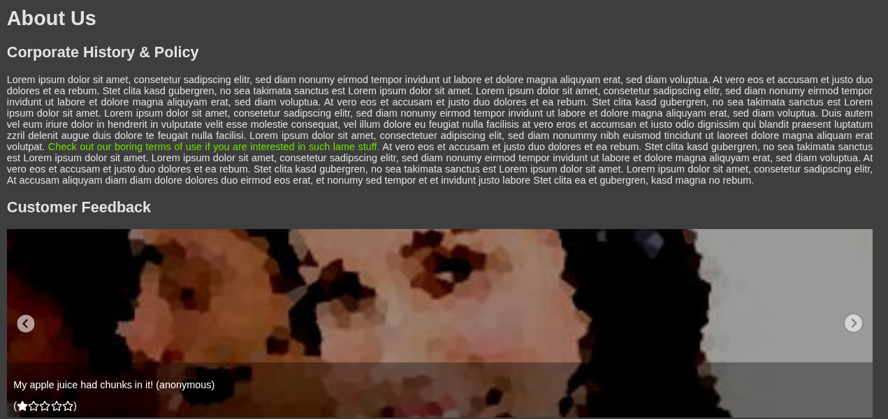
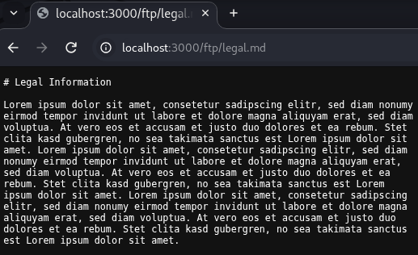
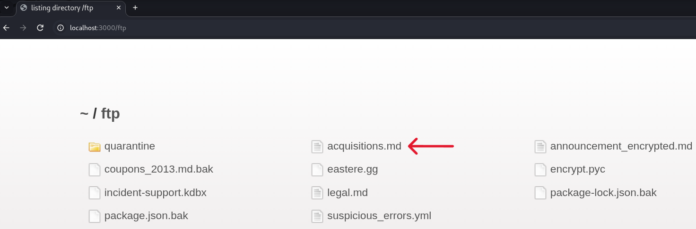
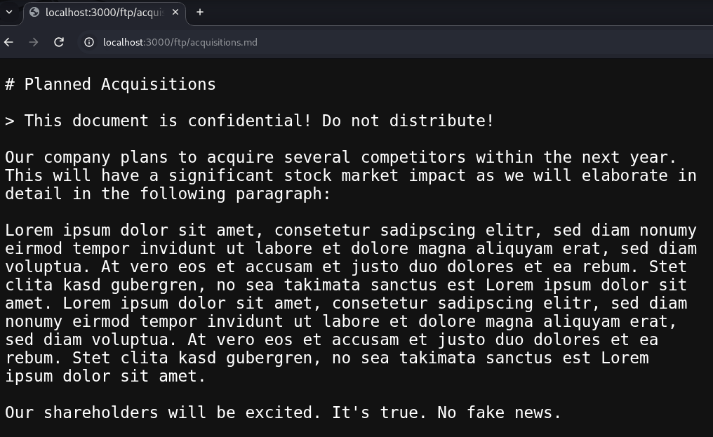
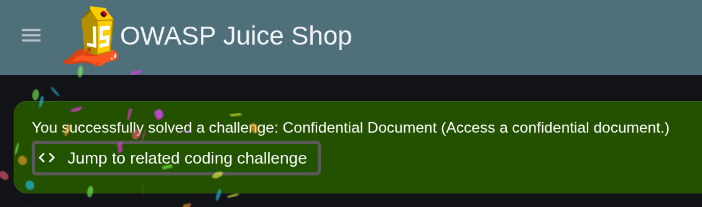

# Offensive 6.1: Access Secured Documents

Found a confidential internal document exposed through Juice Shop's file-serving directory, with no tools, solving the "Confidential Document" challenge. The application serves legitimate downloads from a publicly reachable `/ftp/` directory with directory listing enabled and no access control, so confidential files sit alongside the intended public ones and are reachable by direct URL.

Started on the About Us page, which contains a link to the terms of use. Hovering the link showed it points into `/ftp/`:

The status bar confirmed the target was `/ftp/legal.md`:

Opened `legal.md` directly to confirm the app serves raw files out of that path:

## The /ftp/ directory

Browsed straight to the directory itself at `/ftp/` and got a full listing of every file in the folder, not just the ones the app links to:

Spotted `acquisitions.md` in the listing and opened it by direct URL. The file is an internal memo marked confidential, describing planned competitor acquisitions and their expected stock-market impact:

Loading the file solved the challenge:

The fix is to keep confidential files out of any web-served directory entirely, enforce access control on file downloads, disable directory listing so the folder cannot be enumerated, and serve downloads from an explicit allowlist of permitted files rather than exposing the whole folder.