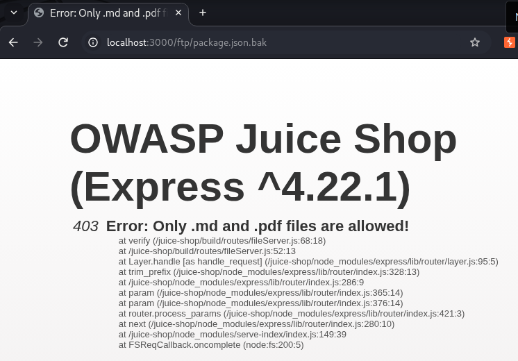
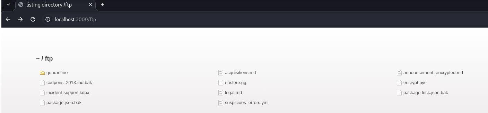
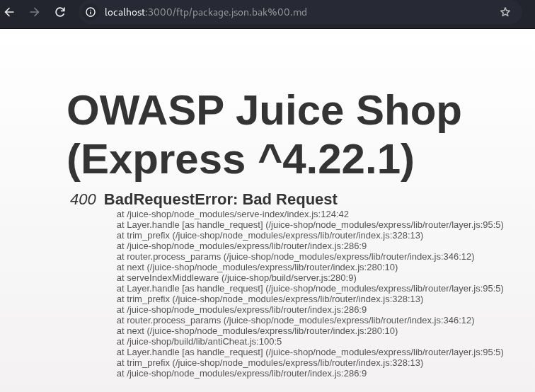
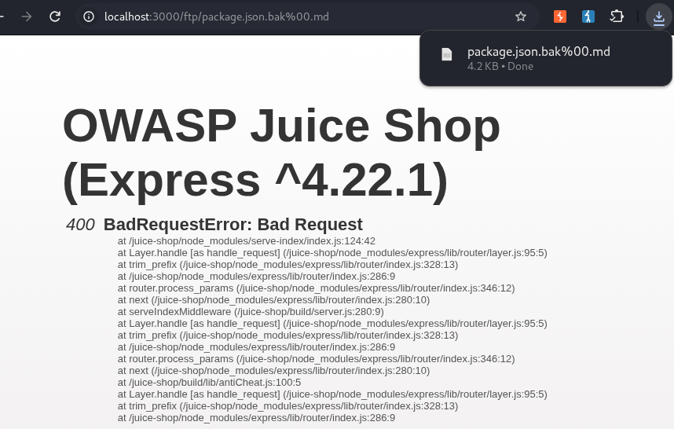
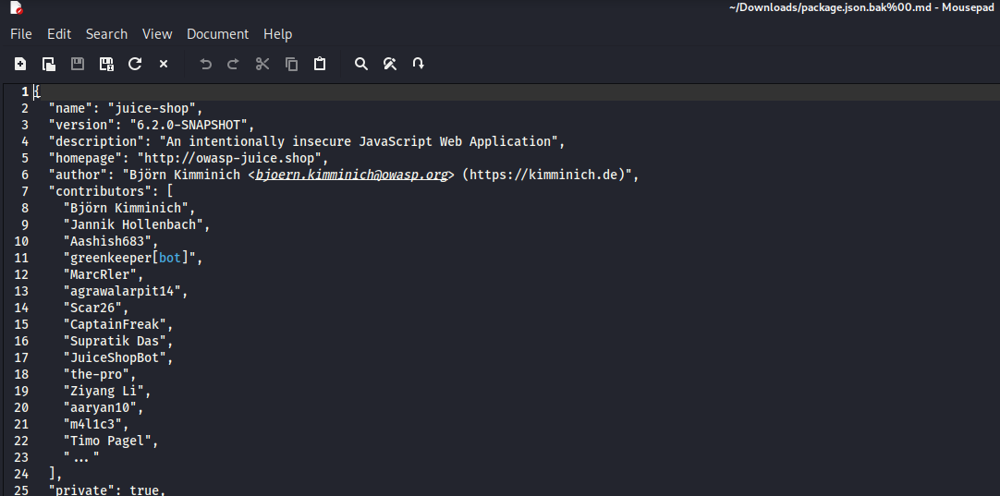
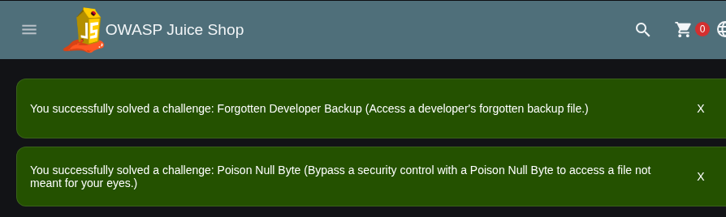

# Offensive 6.2: Download Secured Documents

Downloaded a backup file blocked by an extension filter using a poison null byte, solving both "Forgotten Developer Backup" and "Poison Null Byte." The `/ftp/` download route allows only `.md` and `.pdf`, enforced by a check on the end of the filename that runs before the file is read from disk. A poison null byte lets a request end in an allowed extension to pass that check, while the application's own cleanup routine truncates the name back to the real file.

The target was `package.json.bak`, a backup of the app's dependency manifest. Requesting it directly returned `403 Only .md and .pdf files are allowed!`:



The 403 stack trace shows `verify` at `fileServer.js:68` running before the file read lower down, confirming the filter is a string check on the extension and not a check of the file's actual type. It sits among the other backup and source files in the directory:



## Payload used in the URL

First tried a raw null byte:

```
http://localhost:3000/ftp/package.json.bak%00.md
```

This failed with `400 BadRequestError`. Express decodes the URL path once before the handler sees it, turning `%00` into an actual null byte in the string. Two things then break: the app's cleanup routine scans for the literal text `%00`, not a raw null byte, so no truncation happens, and Node's file API rejects any path containing a null byte, producing the 400.

Raw `%00` returning a 400:



Then double-encoded the null byte:

```
http://localhost:3000/ftp/package.json.bak%2500.md
```

`%25` is the encoding for a literal `%`, so `%2500` survives Express's single decode pass as the three literal characters `%00` instead of collapsing into a byte. The filename now reads `package.json.bak%00.md`, which still ends in `.md` and passes the filter. The cleanup routine then finds the literal `%00`, truncates the name to `package.json.bak`, and serves it.

Double-encoded request in the address bar:


The file downloaded (4.2 KB). Note the 400 error text still on screen is left over from the earlier raw `%00` navigation, since a download does not repaint the page; the `%2500` request itself served the file successfully. The address bar shows `%00` only because the browser decodes `%25` back to `%` for display, while the bytes actually sent were `%2500`:



Opened the downloaded file to confirm the leak, the real Juice Shop manifest with name, version, author, and contributor list:



Both challenges solved:



The fix is to reject or strip null bytes from the path, canonicalize and validate the requested path after decoding rather than checking the raw suffix, keep backup and source files out of web-served directories, and serve downloads from an explicit filename allowlist instead of an extension check.