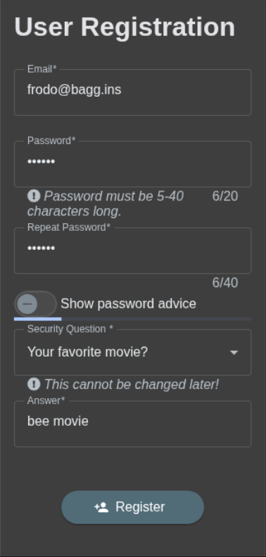
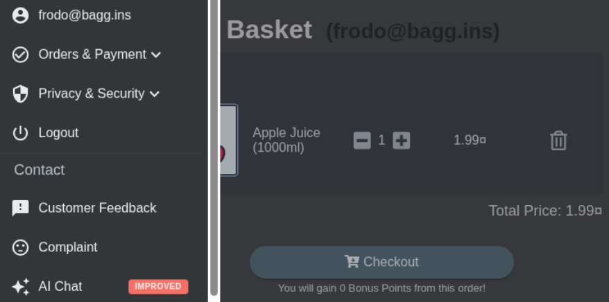
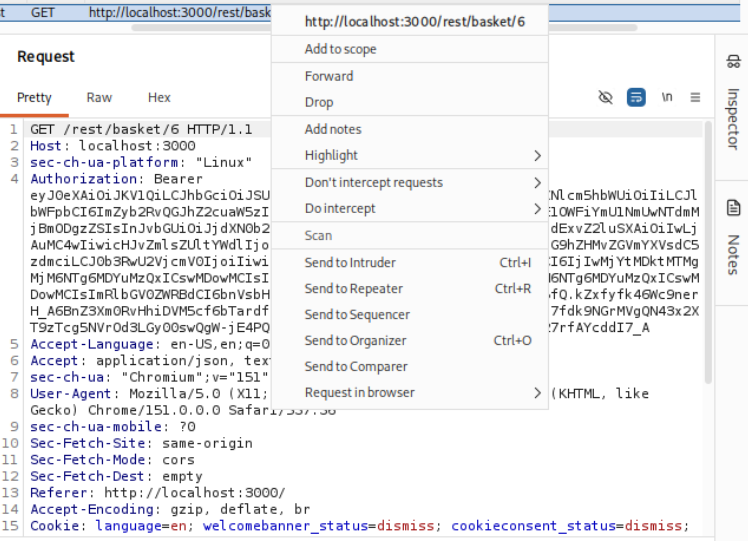
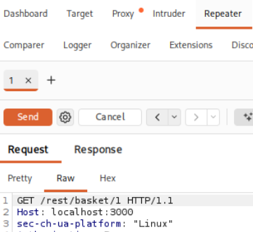
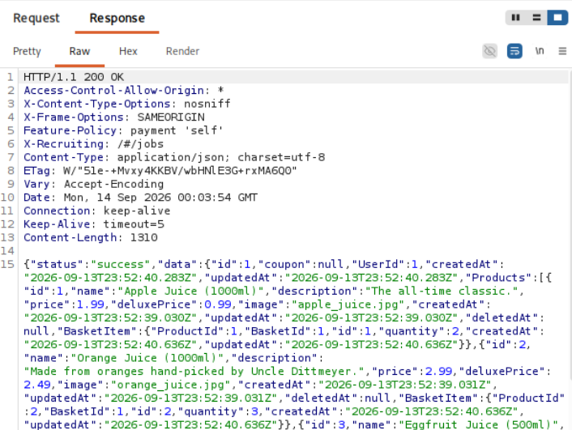
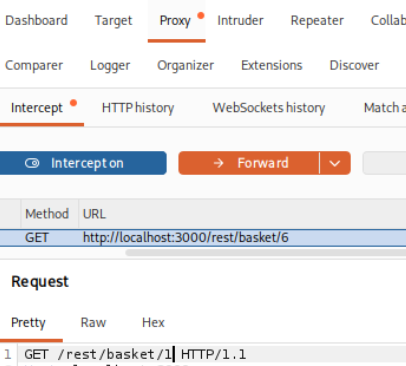
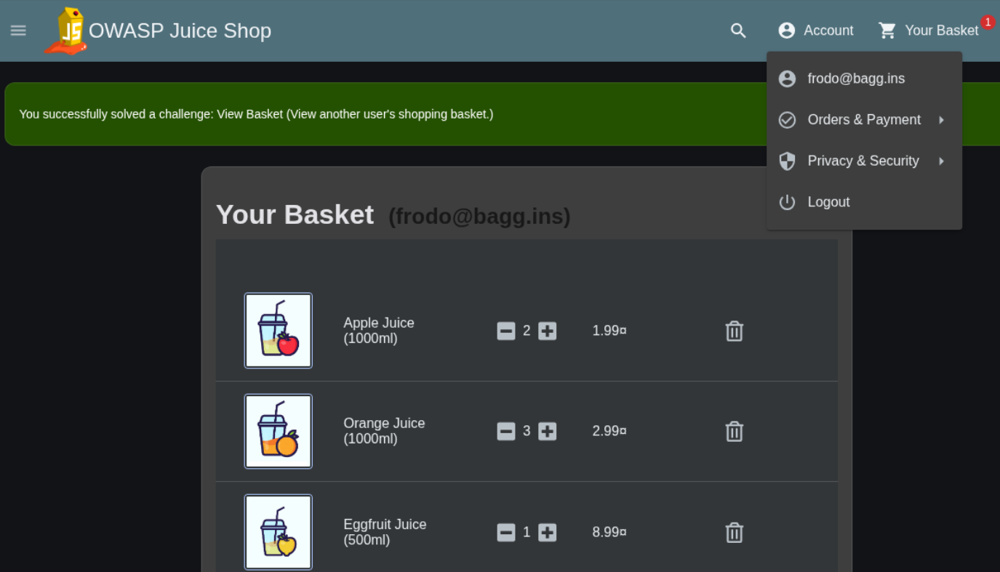
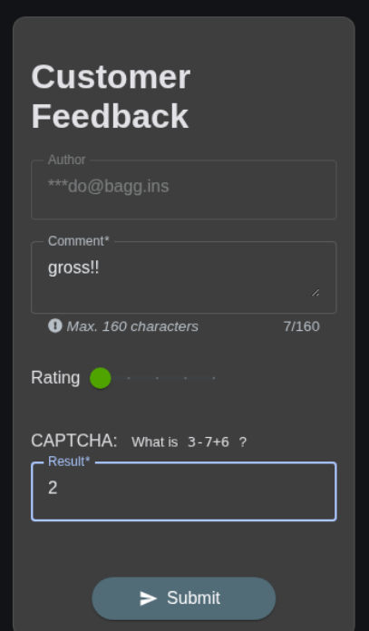
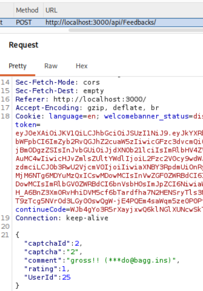
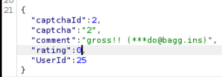

# Offensive 7: HTTP Requests

Used Burp Suite to intercept and modify HTTP requests in flight, producing two findings in OWASP Juice Shop: accessing another user's shopping basket, and submitting a zero-star store rating. Both solve their respective challenges ("View Basket" and "Zero Stars") and share a root cause, the server trusting values supplied by the client instead of validating them itself.

## Part 1: Accessing another user's basket

Registered a clean test account to work from and added a single item, so my own basket held known contents to compare against. My basket contained one item, Apple Juice, total 1.99. Viewing the basket fires `GET /rest/basket/6`, where 6 is my basket identifier. The id is a plain integer, and the endpoint returns whatever basket matches it with no check that it belongs to the authenticated user, which raised the question of what happens when the id is changed to one I don't own.

Captured the basket request and sent it to Repeater. Changed the path from `/rest/basket/6` to `/rest/basket/1`, and clicked Send. The server returned `200 OK` with basket 1's contents: UserId 1, holding Apple Juice, Orange Juice, and Eggfruit Juice, none of which I added. A different user's basket, returned to my session, with no authorization error.

To demonstrate the same tampering against the live application rather than only in Repeater, intercepted the browser's own basket request and edited the id from 6 to 1 in flight before forwarding. The Angular app rendered the other user's three items on my basket page while I was still logged in as my own account, and the "View Basket" challenge flag fired.

This is a classic IDOR (Insecure Direct Object Reference), OWASP Top 10 A01 Broken Access Control. The server confirms the session is authenticated but never verifies that the requested basket belongs to that session. Remediation: enforce object-level ownership on every basket read, checking that the requesting user's session matches the basket owner before returning it, rather than trusting the id in the URL.

New test account registered to work from:

Single item added to seed the basket:

Own basket with one item, total 1.99:

Basket request captured, sending to Repeater:

Modified request in Repeater with the id changed:

Response returning another user's basket, UserId 1 with three juices:

Same tampering live: browser request intercepted and the id edited in flight:

Other user's basket rendered in-browser and the View Basket flag:

## Part 2: Submitting a zero-star rating

The Customer Feedback form takes a star rating from 1 to 5. Filled the form out normally, including the CAPTCHA, with the rating slider at its client-side minimum of 1 star. Submitting sends `POST /api/Feedbacks/`, and the request body carries the rating alongside the comment and CAPTCHA answer.

Intercepted the submission and confirmed the body contained `"rating":1`. Changed it to `"rating":0` and forwarded the request. The server accepted the out-of-range value, stored the feedback, and the "Zero Stars" challenge flag fired.

This is improper input validation. The 1-star minimum is enforced only by the browser slider, and the server never re-validates the range, so a tampered request with `"rating":0`, or any out-of-range value, is accepted and persisted. Remediation: validate the rating field server-side, rejecting anything outside the allowed bounds regardless of what the client sends.

Customer Feedback form filled out, rating at the client-side minimum of 1 star:

Intercepted POST to `/api/Feedbacks/` showing `"rating":1`:

Rating value changed to 0 before forwarding:

Zero Stars challenge flag:

