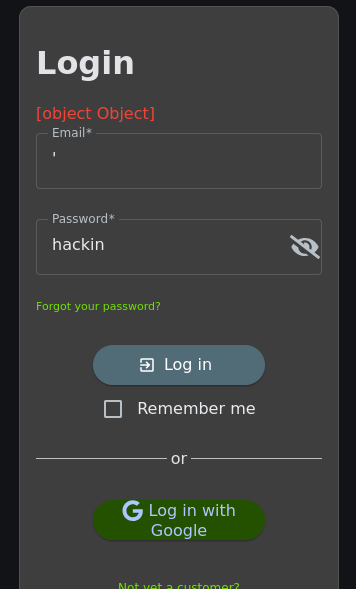
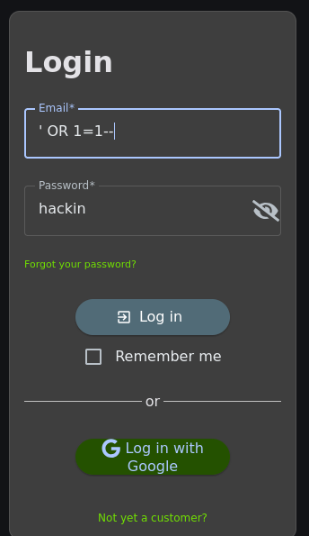
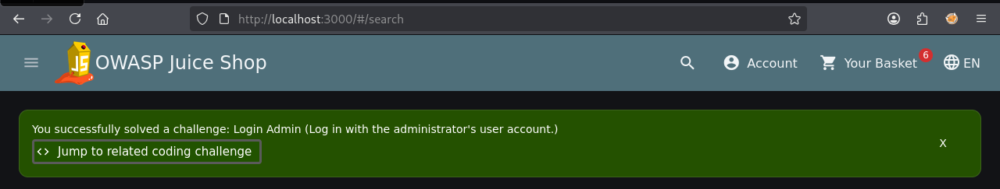

# Offensive 1.1: Admin Log In

Bypassed authentication on the OWASP Juice Shop login form using SQL injection to log in as the administrator without a valid password. The login endpoint builds its SQL query by concatenating user input directly into the string, so anything typed into the email field becomes part of the query itself rather than being treated as data.

Bypassed authentication on the OWASP Juice Shop login form using SQL injection to log in as the administrator without a valid password. The login endpoint builds its SQL query by concatenating user input directly into the string, so anything typed into the email field becomes part of the query itself rather than being treated as data.

Probed the field first with a single quote (`'`) to confirm the input broke out of the string literal. The app returned a generic `[object Object]` error rather than a verbose SQL error, so error output is partially suppressed on the client side, but the fact that a single character crashed the login was enough to confirm the injection point.

## Payload used in the email field:
```
' OR 1=1--
```

This closes the email string with `'`, forces the WHERE clause to always evaluate true with `OR 1=1`, and comments out the rest of the query (including the password check) with `--`. The app returned the first matching user, which is the administrator, and the "Login Admin" challenge flag fired.

The fix is parameterized queries. Input should be passed to the database as a bound parameter, never concatenated into the query string. Input validation on the email field and suppressing detailed error output are secondary hardening steps.

Injection probe with single quote returning `[object Object]`:



Payload entered in email field:



Login Admin challenge flag:

