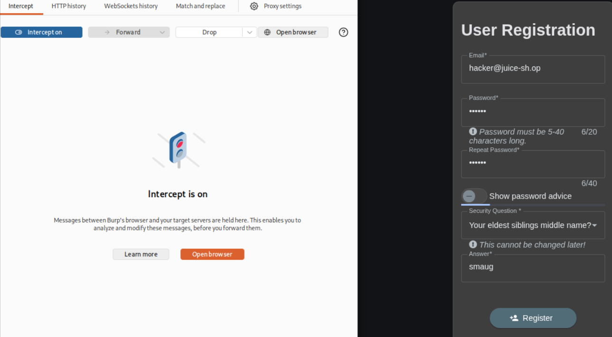
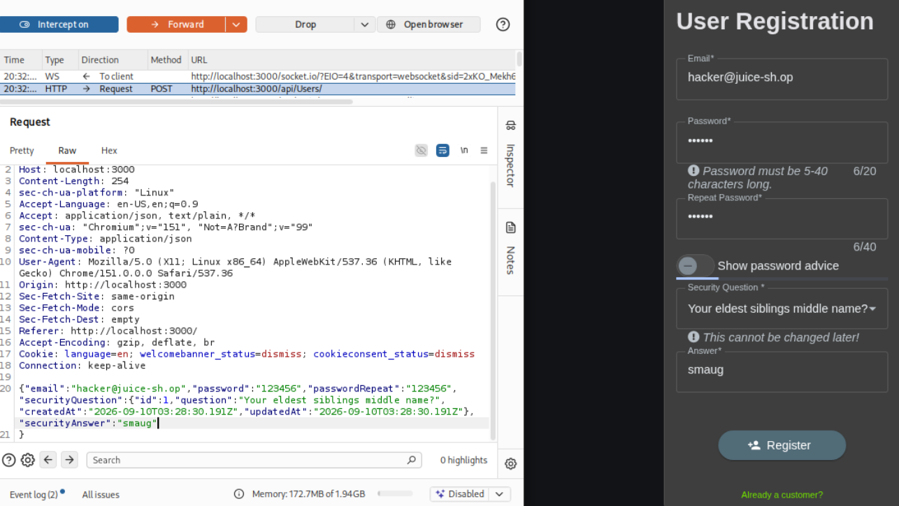
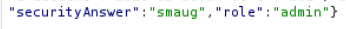

# Offensive 3: Admin Access

Created a new user account with administrator privileges via mass assignment on the user registration endpoint. The register form on the frontend only collects email, password, and security question fields, but the backend accepts additional fields in the JSON body and writes them straight to the new user record without filtering.

Opened the registration form in Burp's built-in browser and filled in valid values for the visible fields. With Intercept on, submitted the form and inspected the intercepted POST to `/api/Users/`. The request body contained only the fields the form asked for. The server had no way of knowing what role a new user "should" have based on the form alone, which raised the question of where the default role is being assigned.

Added a `role` field to the intercepted JSON body before forwarding:

```
"role":"admin"
```

Full modified body:

```json
{"email":"hacker@juice-sh.op","password":"123456","passwordRepeat":"123456","securityQuestion":{"id":1,"question":"Your eldest siblings middle name?","createdAt":"...","updatedAt":"..."},"securityAnswer":"smaug","role":"admin"}
```

Forwarded the request. The server accepted the injected field, created the new user, and stored `role: admin` on the record. The "Admin Registration" challenge flag fired.

This is a mass assignment vulnerability (OWASP calls it Broken Object Property Level Authorization). The backend blindly persists whatever fields the client sends, so any client-side restriction on which fields exist is irrelevant. Remediation: server-side allowlist of writable fields on user creation, assign role/privilege fields server-side only based on server-controlled logic, never trust the client to set its own privilege level.

User registration form on the frontend showing only expected fields:



Intercepted POST to `/api/Users/` in Burp:



Injected `role` field added to the JSON body before forwarding:



Admin Registration challenge flag:

