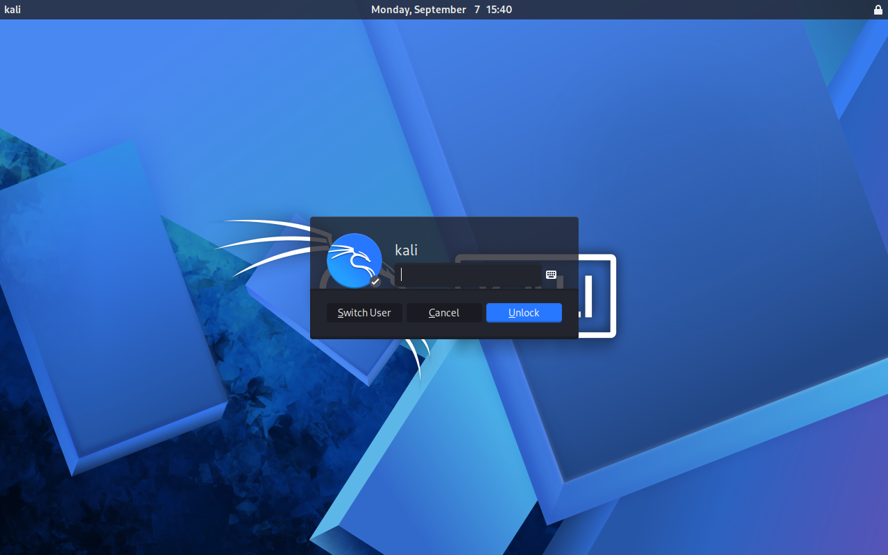

# Setup 1: Kali Linux VM Install

Built a Kali Linux VM as the isolated testing environment for the Live Project, using KVM/virt-manager as the hypervisor instead of VirtualBox/VMware since it's the host machine's existing hypervisor and nothing in the project's toolchain is hypervisor-specific. Built from the official Kali ISO rather than a prebuilt image. VM specs: 8GB RAM, 2 vCPUs, 60GB qcow2 disk (for snapshot support), NAT networking.

Before the VM even existed, the host had no internet despite WiFi showing connected with a valid IP. Diagnosed it methodically and found via `ip route` that the default route was going through `pvpnksintrf1`, ProtonVPN's Permanent Kill Switch interface, which blackholes all traffic whenever the VPN isn't actively connected. Fixed by disabling Kill Switch in ProtonVPN's settings and bringing WireGuard up and back down to force the routing table to rebuild. Also had to manually start libvirt's default storage pool and NAT network, neither was initialized on this host.

Took a clean baseline snapshot after install, before any further configuration.

Kali Linux running in the VM:
