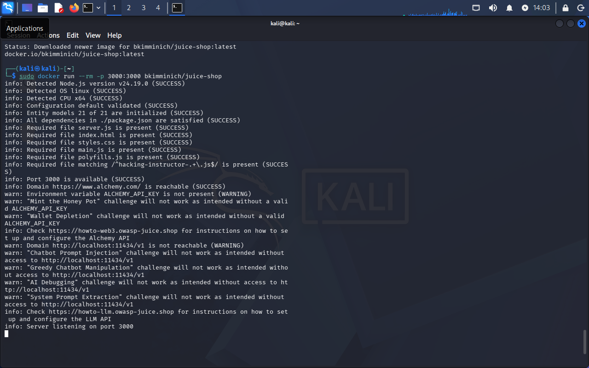
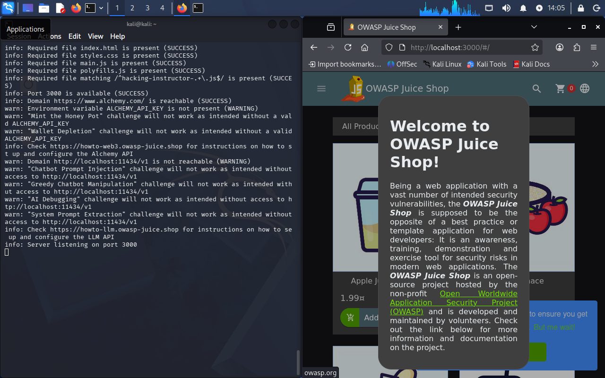

# Setup 2: Docker + OWASP Juice Shop

Installed Docker on the Kali VM and deployed OWASP Juice Shop as a local container, the vulnerable application used for the Offensive Security stories.

```
sudo apt update
sudo apt intall -y docker.io
sudo systemctl enable docker --now
sudo docker pull bkimminich/juice-shop
sudo docker run --rm -p 3000:3000 bkimminich/juice-shop
```

Confirmed it loads at `localhost:3000`. No real problems once the host networking issue from Setup 1 was resolved. `--rm` means the container is removed when it stops, restarting later just means rerunning the same `docker run` command.

Juice Shop container running in terminal:


Juice Shop loaded in browser:

