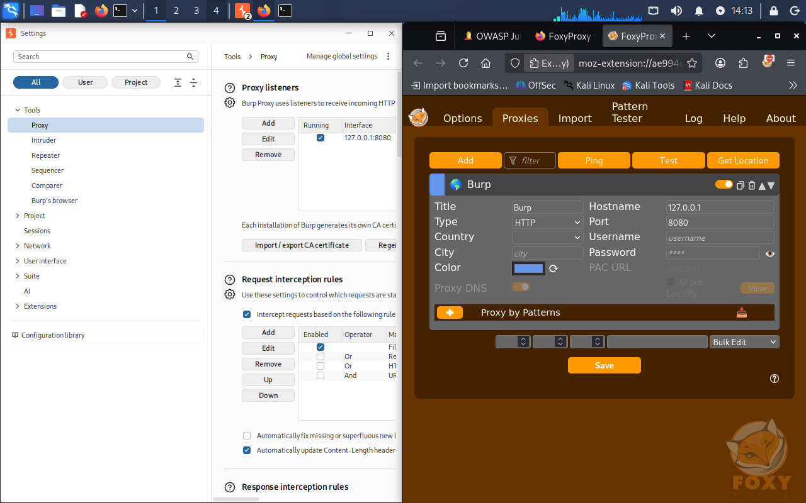
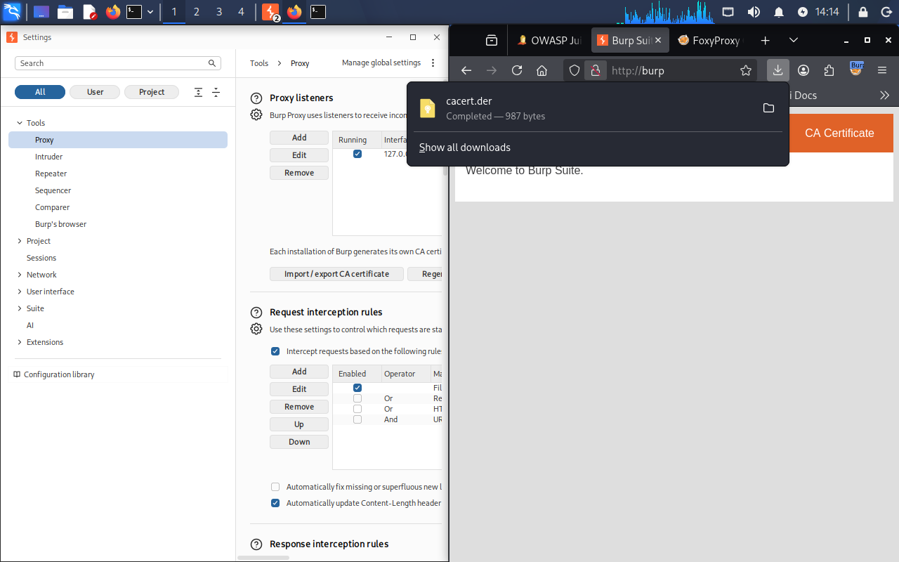
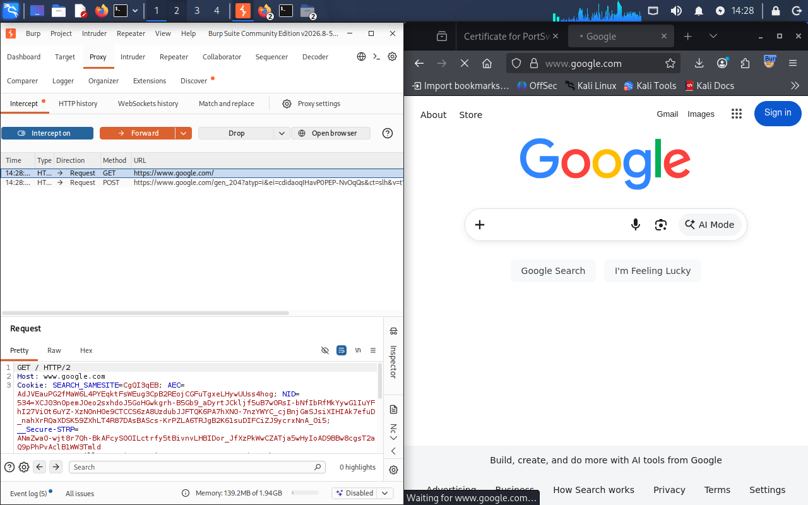

# Setup 3: Burp Suite Intro

Configured Burp Suite as an intercepting proxy using an external browser and FoxyProxy instead of Burp's built-in browser, to build the interception chain by hand.

Set FoxyProxy to point at Burp's proxy listener (`127.0.0.1:8080`), then installed Burp's CA certificate by navigating to `http://burp` while proxied and importing the downloaded cert into the browser's trusted authorities (trust for identifying websites only, not email).

Verified the full chain: HTTPS sites load without certificate warnings, and turning on Burp's Intercept toggle correctly pauses a live request before it's forwarded.

Burp works as a man-in-the-middle proxy by design (`Browser → Burp → Web Server`), which is why the browser has to explicitly trust its certificate. Burp Professional isn't required for this story, some tutorial features are Pro-only and were just noted rather than reproduced.

FoxyProxy configured to point at Burp:

Burp CA certificate downloaded:

Intercept paused on a live request:
